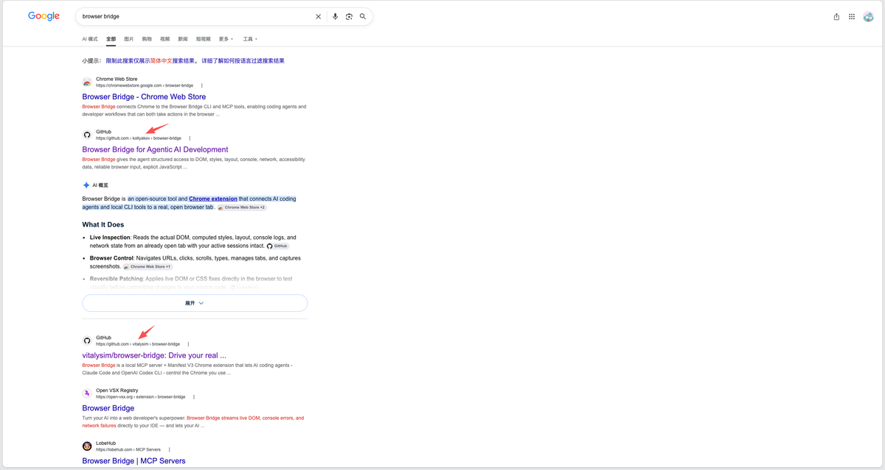
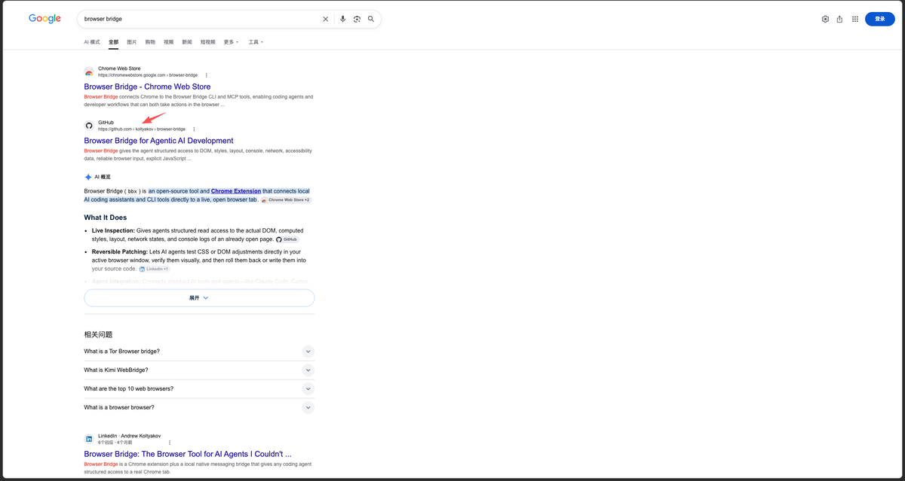
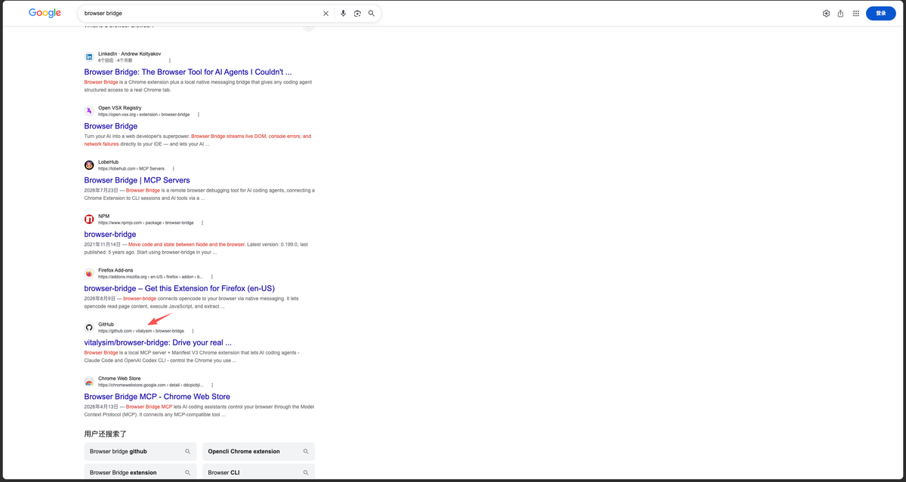
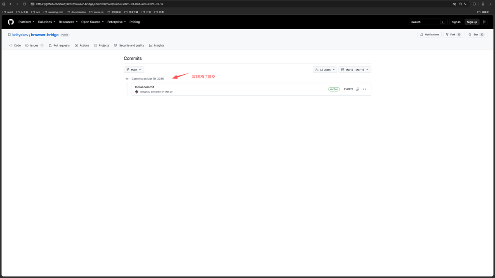

## Browser Bridge 推广过程中的反思（一）

应是在上上周。我突发奇想地在google上搜了下“browser bridge”，于是便有了下图。

这俩是因为我点击过，所以排名很高，实际上在浏览器的无痕模式下的排序如下。

 

即使搜索“browser bridge github”也仍然搜索不到我。

这一刻，我什么也没想，但就隐约感到心里有根刺。

“自己辛苦搞了一个月，怎么就没人来点个star呢？”

说不沮丧是不可能的。

不过，在写这篇日记的时候，那股沮丧的劲儿已经过去了。所以，还是得理性分析。

首先，我想知道的是 **为什么这么多github项目都叫 Browser-bridge？**

似乎起步都比较早，而且到现在为止都还有人在做新的项目，也叫这个名儿。

难道是这个搜索词的流量比较多？从哪里能看到搜索词的趋势？

我记得google console是有个地方能看，但是却不知道具体的位置，还得去摸索看看。

其次， **为什么我的项目排名这么低？** 直接上不了google 搜索

之前，我认为是内容的问题。所以，我在项目介绍中特意加了这个词。

But...

已经过了一个星期，我的项目仍然没有加入到google搜索的结果中。

刚刚，我把能进入到搜索结果中的项目挨个点了一遍。我发现，名字能完全对上的项目， **它们的 star 都不是0。**

接下来，我想就两个step。

\- 到google console 找到看流量词的地方

\- 让项目的 star 先破 0

**我在纠结的点：** 让朋友来帮我点击破零，到底有没有意义。

之前看过一些文章，说是得找人帮忙点点，不然平台的搜索机制你过不了。但我之前想着，自己去写推文，找真实用户，来让项目真实地破零。让star数表示代表着真实的用户数。

今天想想，好像两个破零好像是同一件事儿。

一个是让通过平台的自然流量来获得用户，另一个是自己去找用户。虽然前者让你的star数不再真实，但我的关注点不在 star 数，而在真实用户上。

感觉是殊途同归~

PS: 我找人帮忙点，最多也就几个star，按理说如果star数真的能自然增长，那这几个star也应该能忽略掉。

0

0

0

\\n

<iframe allow="clipboard-write; web-share" src="chrome-extension://cnjifjpddelmedmihgijeibhnjfabmlf/side-panel.html?context=iframe"></iframe>