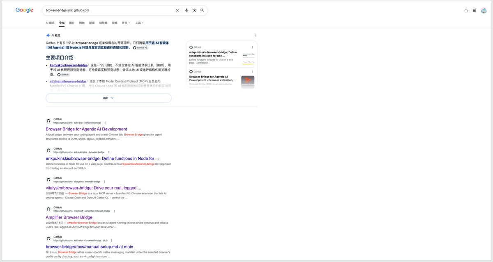
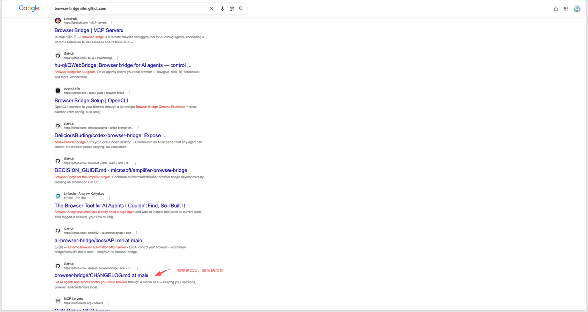
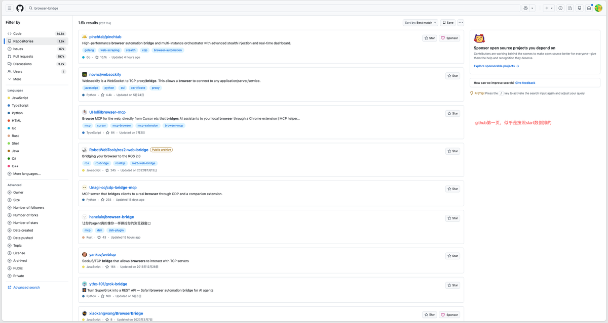

## Browser-Bridge 产品推广与思考 · 墨问

**Browser-Bridge 产品推广与思考**

browser-bridge 这个产品是我上个月（追溯的久一点，甚至可以到6月）做出来的。现在，时间也差不多了，我来简单的复个盘。

**用户数**

用户数本来设定的是10个。这个看起来其实不多，但实际上我很难衡量。因为，我并不是一个个去线下推，在线上我没法知道是不是有人在用。

**Star数**

这个目标设定的是100。现在仍然是 0 ，我想这个可能是跟我不够用心有关。因为，我也不知道怎么去涨 Star 数，我所能做的是尽量提升在 github 里面我的关键字搜索排名，后来我也就不了了之。

不过，我发现 google 搜索似乎也能带来流量，所以我感觉后续可以沿着站内的热门关键词、google 搜索热门关键词，来优化。（尽量别搞 0 star，真有点受打击）

**通过 Google 搜索发现的问题**

我之前一直在 github 站内搜索，从来没有试过在搜索引擎上找。今天，无意间发现 **搜索引擎似乎更加精准。**

我搜索 Browser-Bridge，得到的结果是以项目名，或者项目描述中有这个关键词的结果为优先，而 github 站内的搜索，似乎让我看不懂。

  

先不管看不看的懂了。总之，现状就是在 google 搜索我的项目名时，我在第二页很靠后的位置。而在 github 上搜索我的项目名是，根本搜不到我自己。

**下阶段的目标**

**目标还是 Star数破 100，真实用户数破10。** 这个其实在开源项目中真不算什么，不过，只要能破这个数，我就觉得有种征服感。

即使是征服的是自己~~

不过，我这次想尝试优化的是搜索引擎。我想先优化 github 的站内搜索，起码得让我能排进首页吧~

0

0

0

\\n

<iframe allow="clipboard-write; web-share" src="chrome-extension://cnjifjpddelmedmihgijeibhnjfabmlf/side-panel.html?context=iframe"></iframe>