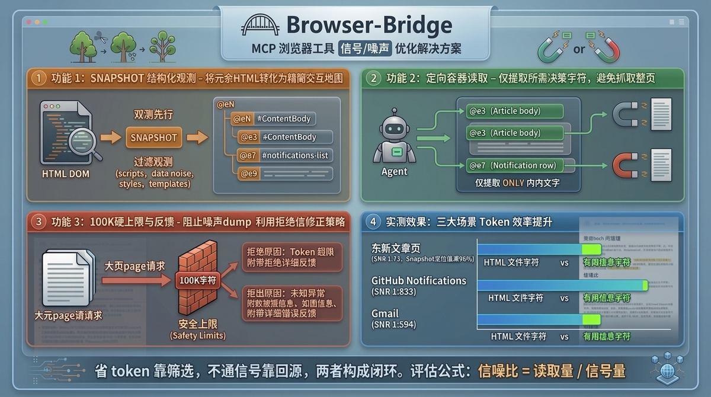

## Browser-bridge 新版本中的内容降噪设计

一转眼，两个多月过去了。本以为 Browser-bridge 没什么功能好更新的。毕竟，作为一个Agent操作浏览器的工具来说，基本功能已经实现。

（作为程序员出身的我，经常会认为产品的功能开发好了就是结束。\[笑哭\]）

然而，就在上周末休息的时候。

我想起两个月前，用 Claude Code + Kimi k2.6通过 Browser-bridge，帮我操作 gmail 进行邮件读取、分类、标记已读。

**可是就这个一个简单的需求，直接把 5小时 限额给耗完了。**

好奇心上来的我为这事儿深入分析了下。发现 gmail 的页面，元素定位很隐蔽，kimi k2.6经历了17轮工具调用才分析明白。

关键问题还是在于，页面的内容太大。整个页面下载回来之后， **Claude Code 默认会把大的工具调用结果存储在本地的文件中，并在上下文指向这个文件，以防止上下文爆炸。** 而后面的16次工具调用其实都是在写代码、清洗、分析这个页面。

换句话说， **html这样的页面结构对Agent来说并不够高效，信息密度不够高。** 很多js、css，甚至是页面元素标签，都是为了页面渲染而编写的。在信息提取这个场景中，这些内容不仅没用，反而是干扰，压缩了有用信息的空间，毕竟 context 是有限的。

（在1M上下文时代其实没太大影响，但这是无谓损失）

分析到这里，产品的迭代思路就很明确了。 **关键就在降低噪音这个点儿上。**

## 降噪设计

**JS和CSS的过滤。** 这个是大头，我的做法是直接使用正则匹配，移除掉。

**html标签属性简化。** 很多前端框架会在元素标签上添加属性，这些其实是做交互才需要的，信息提取这个场景下根本不需要。我只保留 id、name、value属性，其余属性都剔除。

**无用的html标签合并。** 单个html标签其实本身并不太占空间，可它们总是成群出现。为了渲染好看的页面样式，很多的标签都嵌套了很多层，这对信息提取来说也是无用的，而且也占了很大一部分信息空间。在这次的版本中合并了相邻层级的重复标签。

**为了进一步压缩语义，我选择，使用自定义的语义标签来替换html的原生标签。** 因为，我们只需要知道元素是只读还是可点击即可。

## 交互操作的重新定义

在最开始的版本中，我将整个html的文本直接提取返回。

接着就发现很多网站中都有页眉和页脚，甚至还有评论、广告等区域。

整个信息仍然是不必要的损耗。所以，我创建了一个snapshot指令。 **我在snapshot中返回的是页面结构，重点返回的是按钮、信息层级** 。当数据超过 4k字符的时候，会截断。

**Agent的优势是它自己就懂得重试。** 当一个页面的结构在4k以内的时候，snapshot的调用就已经能获得完整的页面结构信息。想获取具体信息的话，通过get\_text就能拿到纯文本。而如果一个页面的结构超过了4k，snapshot工具会截断。此时，Agent 自己就会缩小提取范围，只要把页面元素的id或者selector传入来进一步缩小信息的获取区域。

**为了达到这一目的，新版本中我在所有tool描述中都加了一句“当你明确结构之后再调用这个工具。而在你不确定页面结构时，通过snapshot来获取。”**

我拿东财的页面、gmail、github notification分别测试了下， **大约能降低 98% 的数据量。**

## 意外之喜

当我把页面的噪音数据剔除之后，这个产品得到了近乎 **一个数量级的提升** 。在此之前gmail提取任务，需要将近20分钟的时间以及5小时限额的token，现在只需要2分半到3分钟的时间并且token消耗在5小时限额中的1%左右（Kimi 200的那档）。

项目地址： [https://github.com/dkisser/browser-bridge](https://github.com/dkisser/browser-bridge)

字数 1540 / 20000

<iframe allow="clipboard-write; web-share" src="chrome-extension://cnjifjpddelmedmihgijeibhnjfabmlf/side-panel.html?context=iframe"></iframe>