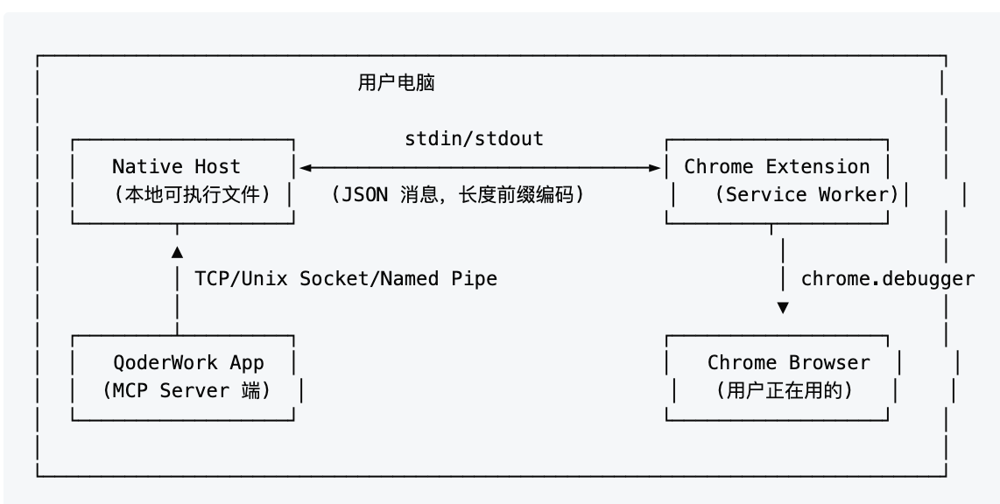

## 「Agent在控制你的浏览器会话」 · 墨问

**「Agent在控制你的浏览器会话」**

首先，我想了解下。大家知道 Agent 如何控制你的浏览器帮你调试程序或者查看邮件吗？

这个问题有个很简单的答案。直接给 Coding Agent 安装一个 chrome-devtools-mcp 就可以让它使用我们的浏览器，这非常方便。

但是，它其实打开了一个新的 Chrome 实例（通常包含参数 --remote-debugging=9222），麻烦就麻烦在这个新开启的实例是没有登录态的~

那有没有解法呢？

Codex 和 Qoder 也想到了这个问题，他们提供了浏览器插件来解决这个问题。而这些 Agent Chrome Extension 背后的原理并不复杂。 **关键就在于一项 2013年就诞生的技术，Chrome Native Messaging。**

唯一需要解释的就是这个 Native Host。 **当开启了Chrome Extension之后，Native Host文件就会运行，它会启动一个本地辅助进程，负责接收 MCP Server的指令，并通过 Chrome Native Messaging 转发送给 Chrome** 。

指令设计并不需要特别复杂，访问网页、获取元素（网页）内容、执行Java Script、填写表单、滚动网页等指令就足够。

写到这里，你会不会觉得有点懵？

Chrome Extension的职责好简单，就负责启动一个后台程序，接受 MCP Server的IPC消息然后通过Chrome Native Messaging转发给Chrome就好，为什么需要设计一个 Chrome Extension 而不是直接后台运行一个后台进程就好？

在我看来这样设计比后台进程的方式好很多。 **最关键的一点在于，它不仅在警示用户“AI 正在使用你的真实身份上网”，也能在发现有问题时通过开关来阻止这一切。**

至于来不来得及阻止，那就看手速啦~

\---参考文档

[https://www.eweek.com/development/google-chrome-browser-adds-new-native-messaging-api-for-developers/](https://www.eweek.com/development/google-chrome-browser-adds-new-native-messaging-api-for-developers/)

0

0

0

\\n

<iframe src="chrome-extension://cnjifjpddelmedmihgijeibhnjfabmlf/side-panel.html?context=iframe"></iframe>