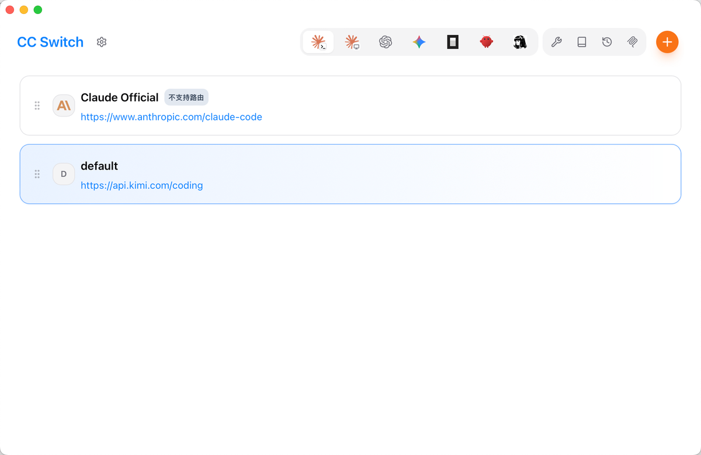
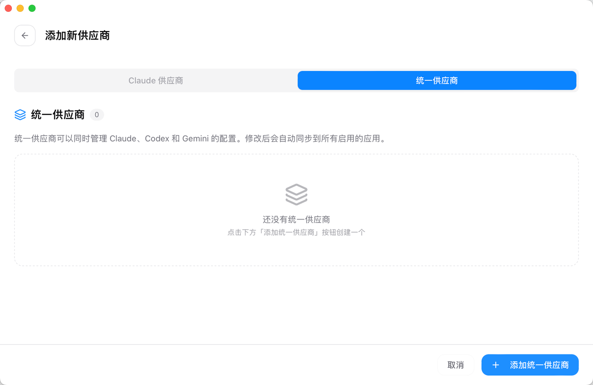
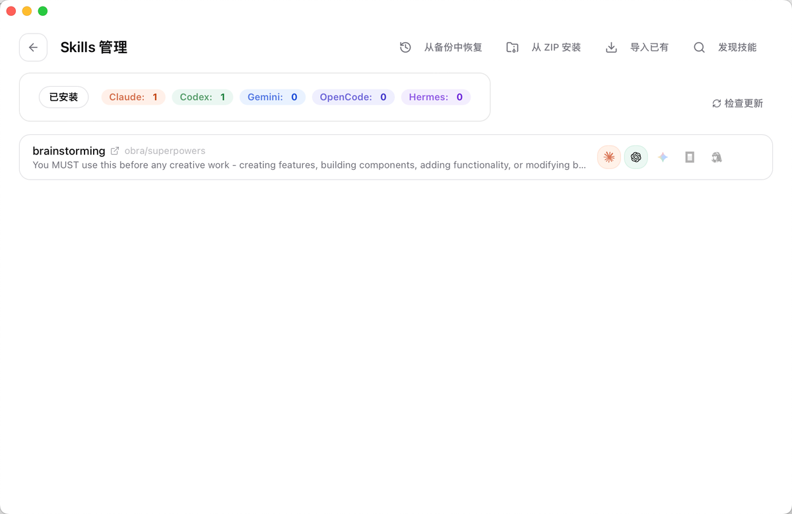
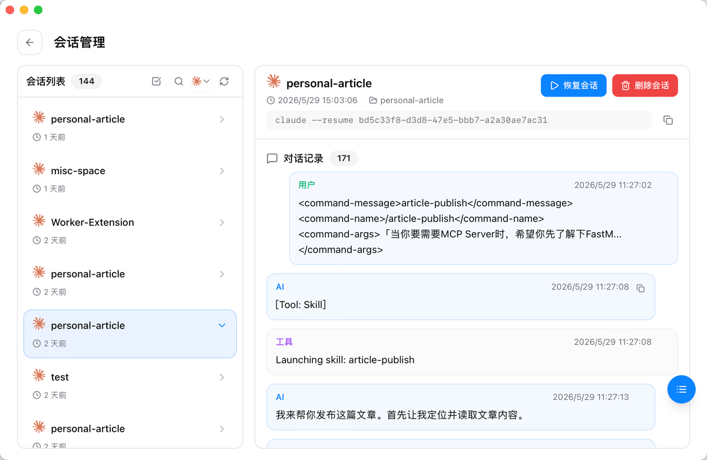

## 「CC-Switch还真是个不错的产品」 · 墨问

之前就听说了 CC-Swtich 可以无缝切换 Claude Code 底层的模型供应商，我想着这不就一个脚本的事儿吗？今天上手之后感觉打开了新大陆似的

（还是自己以前太傲娇啦，真得给 CC-Switch 磕一个）

**Coding Agent LLM供应商无缝切换**

支持 Claude Code、Codex、Gemini（应该要改名叫反重力了~）、OpenCode、龙虾、爱马仕。

如果，你订阅了一个 Coding Plan，想在好几个 Coding Agent 中使用。比如我，在编程的时候使用 Claude Code。而在日常外出时突然蹦出一个灵感，我会使用龙虾。

是不是要配置两遍呢？

NO，它还可以配置 **“统一供应商”**

**SKILLS 管理**

我自己常用的 Super Power 我在 Claude Code 配置成全局共享了。可是我在开发前端时，常用的是 Cursor，我得重新配置。

好消息：CC-Switch 可以把 SKILL 直接无缝同步。

坏消息：不支持 Cursor 或者 Qoder。

当然，还有MCP、提示词的管理。这里我暂时没怎么用，就不介绍了。

**历史会话管理** ，是我真正觉得好用的地方。

之前我用 Claude Code 时，我一直想找一个可视化的地方来管理会话。当然，也找到了一些开源项目，只是我觉得这个小需求还得需要额外部署一些服务，有点....说不上来的味道。但是 CC-Switch 顺手解决了，我感觉挺好。

使用 Coding Agent 时切换模型供应商这个需求肯定会有，毕竟不同的模型侧重点都不一样。在解决这个问题的同时，顺手解决一些周边的小需求，CC-Switch 的设计者真聪明。
