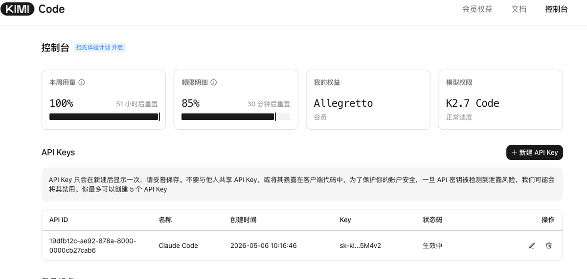
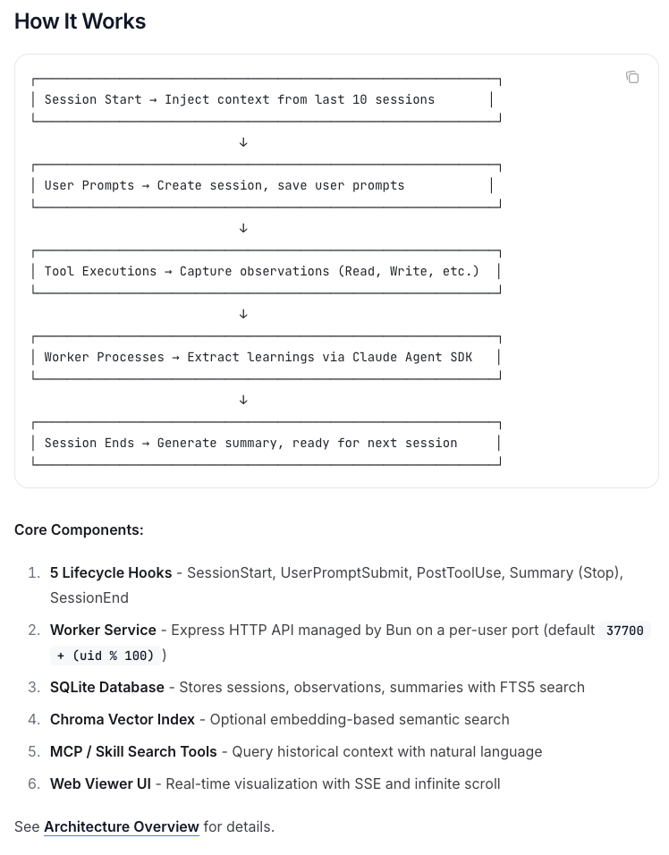
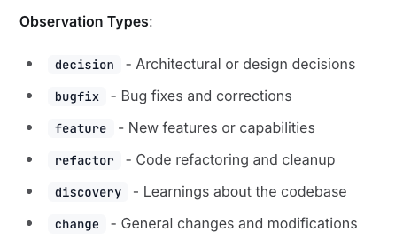
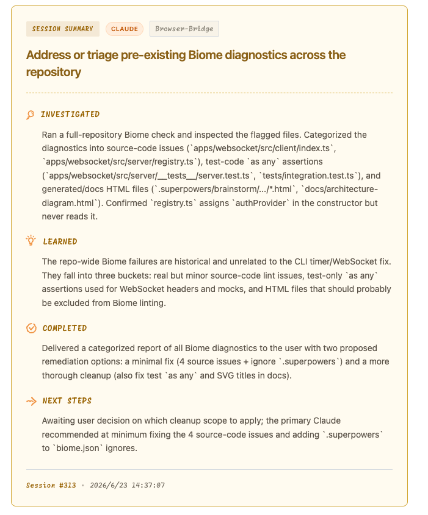
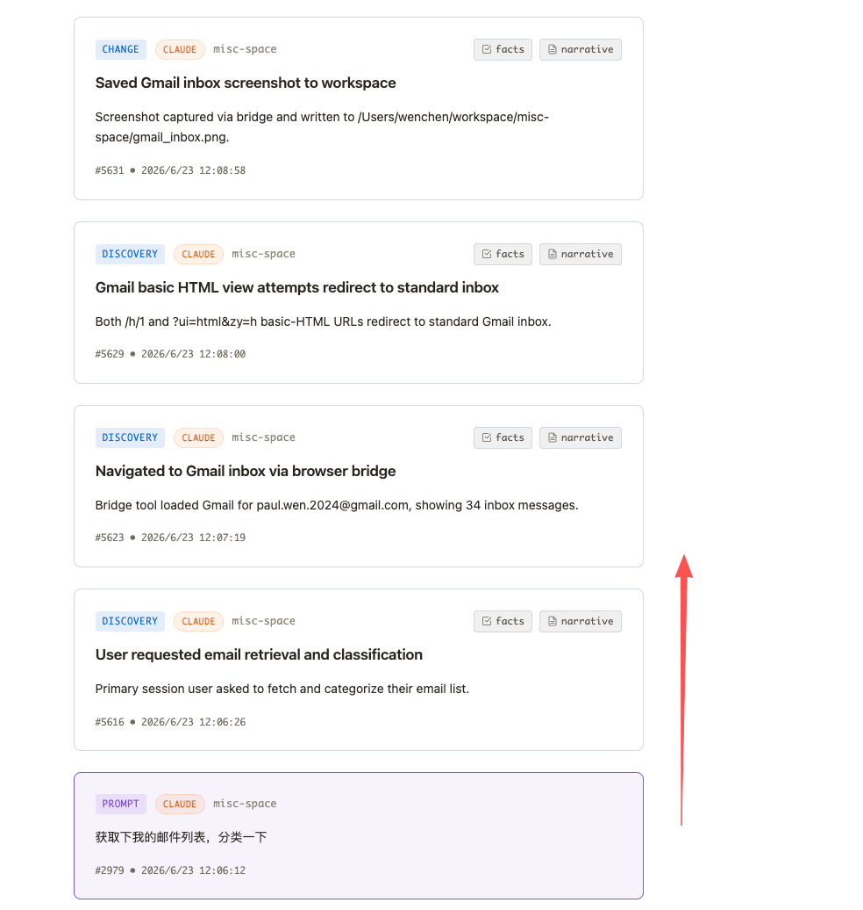
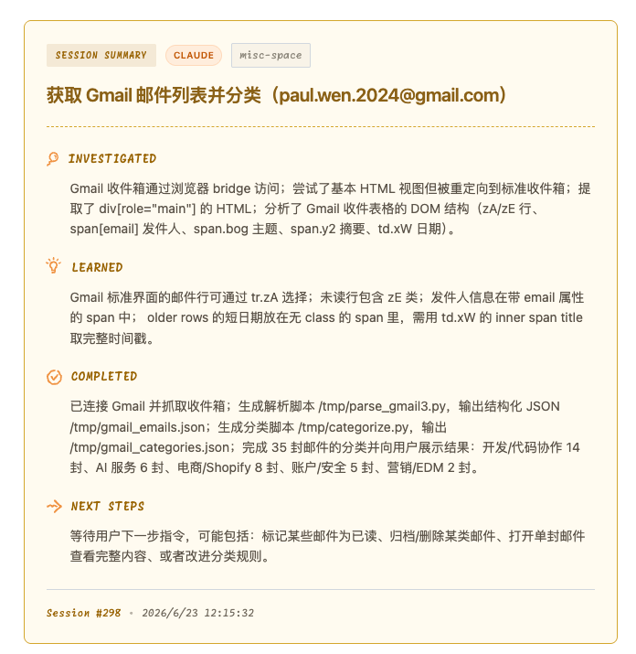
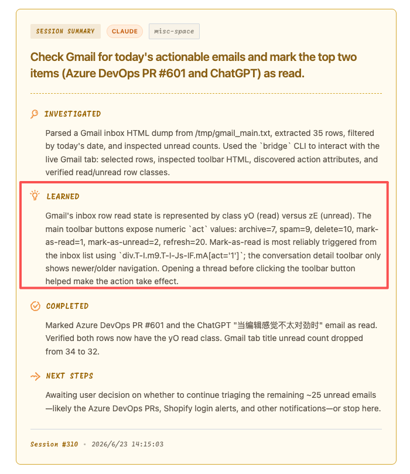
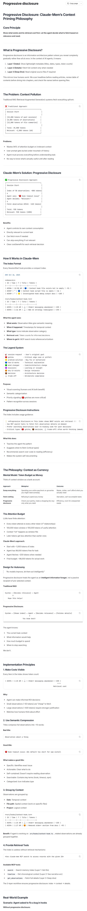
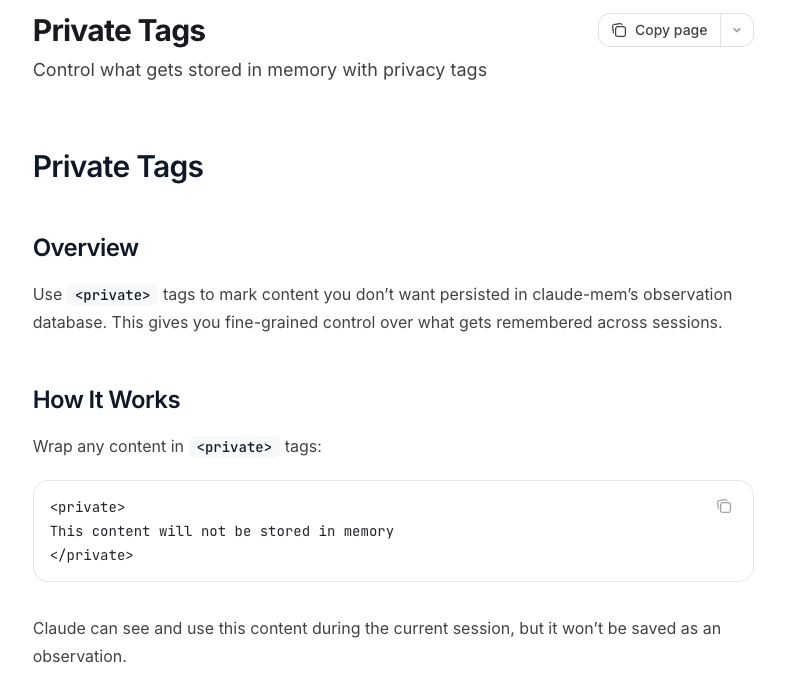

## 「Claude-mem 核心原理解读」 · 墨问

前面几天折腾来，折腾去，终于把 Claude-mem 的用量问题解决了。本以为可以放心大胆的敞开了用，可没用两天就发现这周的额度到了。

还有52小时刷新，那你...我这...额....

我这就真好奇了，到底是哪里在消耗我的token？怎么之前每周的用量都够，还能剩20%，现在就用不够了呢？带着这个问题，我开始kuku研究~

**Claude-mem 的工作机制**

消耗token的地方有两处。一是调用工具的时候（PostToolUse），生成 Observation，一是会话结束的时候，生成 Summary.

**Observation 与 Summary**

Observation 是通过数据库字段来结构化的，具体的表结构设计可以参考： [https://docs.claude-mem.ai/architecture/database#session-summaries-fts](https://docs.claude-mem.ai/architecture/database#session-summaries-fts)

Summary的不同之处在于，它是完全由AI总结而来的结构化内容，固定的 **Investigated、Learned、Completed、Next Steps**

那回到最开始的问题，究竟哪里烧的多了呢？

我注意到文档中特地提到了一个地方 “PreToolUse for `Read` ”，也就是说 **只要是读取类型的工具调用，都会去总结。**

我想起来，刚刚让AI去使用 Browser-Bridge 看看我的邮件，然后分类。难道是这个原因？

带着这个疑惑，我翻了翻 Claude-mem 的 WebUI，还真让我找到了元凶。

每次查询页面元素，获取页面内容，都会触发 Claude-mem 的 Observation。所以，Token一会儿就烧没了。

不过，在网上滑动的过程中，我发现了一个小惊喜。Claude-mem 总结除了 Gmail如何进行选中，时间日期的读取以及如何标记为已读。

 

烧了一次，下次就好了~~~

为什么这么说呢？这里就不得不提到 Claude-mem这个项目设计的意义了。

**跨 Session 记忆**

其实最上面的数据流图里面也说了，它会在 Session 开始的时候，携带这个项目相关的10个session（可以配置，好像默认是每个session中最近的50次Observation）

**这样子一想，我又开始好奇为什么它的上下文不爆炸？**

第一时间我想到的是“按需加载”，但是我想不出来到底需要什么内容。

哪些是在启动时一定要加的Root Prompt？这些Root Prompt，什么时候生成，又什么时候保存呢？

官方原文： [https://docs.claude-mem.ai/progressive-disclosure#claude-mem%E2%80%99s-solution-progressive-disclosure](https://docs.claude-mem.ai/progressive-disclosure#claude-mem%E2%80%99s-solution-progressive-disclosure)

我简单说说从上面文档中理解的内容。

首先，Claude-mem 的设计者认为 RAG 每次都会召回的内容太多，浪费模型的上下文（算力）。同时，如果像 Claude-mem 一样把整个session过程中的所有内容（每次工具调用、Summary）都拿去做 Embedding 是一个额外的开销，会让系统变得太复杂。最后，他认为 RAG 不管按照什么策略来切片，都不一定准，只有在上下文当时产生的环境里面去做总结，这里面的信息是最保真的。

The agent knows:

\* The current task context

\* What information would help

\* How much budget to spend

\* When to stop searching

We don’t.

回答上面的Root Prompt问题。

我提出的 Root Prompt，在 Claude-mem 的视线中，其实就是每个 Observations 的 title。

检索顺序： title -> summary -> origin content

讲到这里我发现，Claude-mem 做的事情其实都在围绕 **“让最相关（近）的内容能主动进入（直接注入）上下文”** ，而不是被动的去查询。

RAG 的典型流程是什么？你有问题，系统去向量库里搜相关段落，再把结果塞给模型。关键词是 **query** 。你不问，它不动。

Claude-mem 相反。它把 Claude 每次 Read、Edit、Bash 都变成 observation，压缩、摘要，然后在下一次会话开始时，自动挑相关的注入系统提示词。关键词是 **inject** 。

换句话说，是把向量数据库的那一道向量相关计算，以及召回的过程省掉了，直接换成SQLite的查询结果。

看到这里我的最后一个一问是，这东西有办法关吗？我在用 Agent 调试的时候，其实我并不需要这些东西，有啥办法吗？没找到好用的，但是找打了一个tag，不清楚到底有没有用。

0

0

0

\\n

<iframe allow="clipboard-write; web-share" src="chrome-extension://cnjifjpddelmedmihgijeibhnjfabmlf/side-panel.html?context=iframe"></iframe>