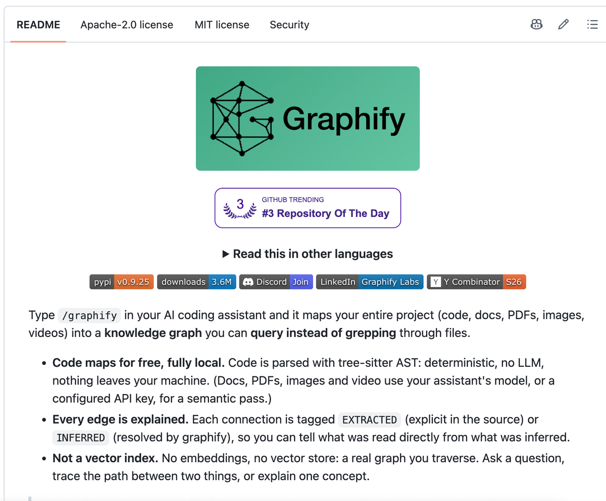
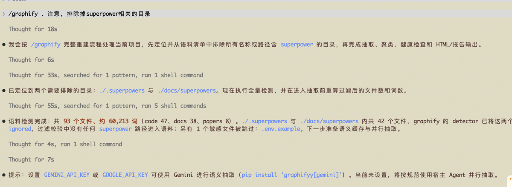
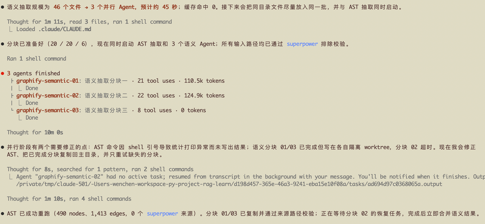
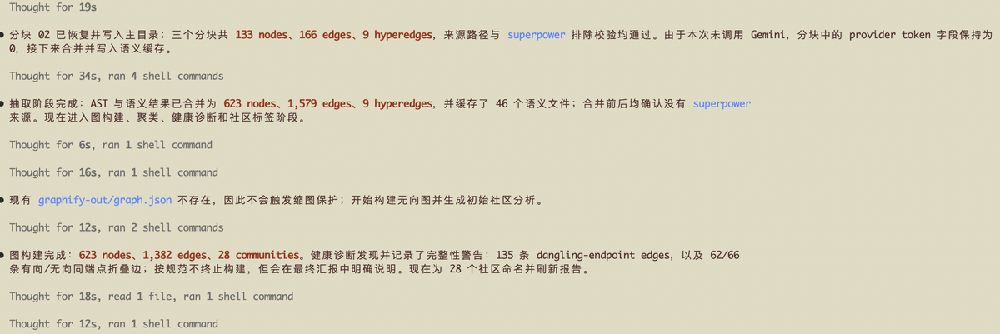
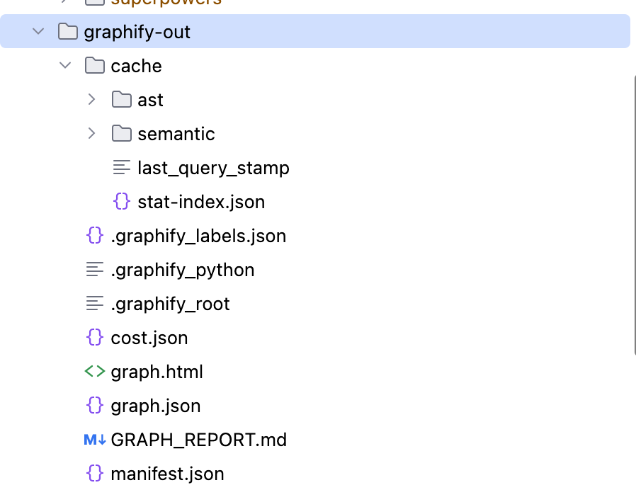

## 「Graphify拯救了我的钱包」 · 墨问

前天临近下班的时候，边上的两个同事在抱怨 Codex Pro 的周额度不够用。他俩聊着聊着，聊到了平替，然后又拉着我一块儿聊，想问我有没有省 token 的好办法。

我脑子里转了下，想起了之前看到的一篇 Graphify 的小软文。于是我就把 Graphify 的链接给了他们，让他们要是感兴趣的话就可以试试。

不出意料，他们没有的去了解。

（我猜想他们也许是单纯的想找我聊天吹牛，没想到被我搪塞住了~）

当天晚上到家了之后，感觉不是滋味，总感觉有什么东西在我心里。想来想去，我发现其实自己对怎么省 token 这个问题，也是很感兴趣，但是也很犹豫、纠结。

一边是想起自己之前 Kimi 用完的时候，各种难受，工作基本做不了。觉得，确实需要找到一个省 token 的好方法。另一边又觉得找各种方案，折腾起来太累。而前段时间又订阅了 Minimax，现在已经不缺 token 了。所以，我在纠结到底需不需要去研究。

在我犹豫的时候我也没闲着，我还是打开了 Graphify，仔细看了看介绍。

这里的 AST 激起了我的好奇。

我想起来之前 IDEA 里面也会有很多的索引，背后都是利用 AST 构建的。在 IDEA 中这些索引可以让你在编码（或重构）的时候快速访问（导航）其继承树、调用链等等。

现在 Agent 在写代码的时候找继承树和调用链都是通过 grep/glob 等系统工具，虽然工具足够有用了。但每次都需要大量的检索、读取，最终才能过定位到我们真正想要改动的地方。

引入 AST 后，直接通过关键的方法名或者类名，就可以精准定位到代码中的具体继承、调用链等信息，最关键的还是能精准定位到代码行数，省掉很多不需要的文件读取（如果文件超800行，很多 Haeness会选择分片读取文件内容，这样一来可能就需要多次读取才能定位到自己需要的内容）。

想到这里，我一下子兴奋了起来，立马本地安装了一个。

  

安装完后项目中会出现一个 graphify-out 目录，这里面就是所有的 AST 数据。

graphify 还配了个 skill，要求跟代码上下文相关的内容都要走 AST 先扫一遍，定位到精确的文件之后再调用 Read工具。

不过，有个小坑。除了代码之外，graphify 目前还会把项目中的所有图片、视频等也放进 AST 中。

可是，项目中很多的文档可能只是作为历史记录或者备份。在实际情况中，这些文档是为了保留系统的演进思路，只有在需要做兼容性改动的时候才需要。

好在，graphify 提供了.graphifyingore 文件。但，一定要在初始化之前就要配置好，否则 AST 只能重建，会重新读一遍，很浪费时间。

经过这两天的使用，我暂时没发现 token 省了多少。但是，定位代码倒是变快了不少~

0

0

0

\\n

<iframe allow="clipboard-write; web-share" src="chrome-extension://cnjifjpddelmedmihgijeibhnjfabmlf/side-panel.html?context=iframe"></iframe>