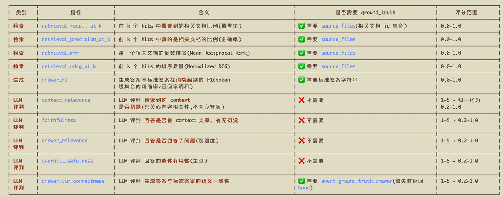

## 「RAG 从入门到精通 - 总结」 · 墨问

**「RAG 从入门到精通 - 总结」**

RAG 相关的内容已经做了半个月，中间也出了几篇文章。到了今天，我在复盘的时候，总感觉这些内容很水，或者说真正重要的东西，并不多。

**RAG常见的技巧**

Hybrid Search、Sub-query、Classifier、Reranker、Query 改写等等，这些是面试中最常问到的。

“Hybrid Search 该怎么搭建？Sub-query、Classfier 该怎么做？Reranker的几种实现和各自能解决的问题？Query 改写有什么技巧？”

这些问题，随便拎一个出来讲也都能讲半小时以上。但 **我觉得，真正重要的是 Evaluation，是你要知道你的RAG当前处于什么状态，有什么问题需要解决，解决的方案需要足够的泛化能解决一类相似的问题。**

我这次构建的目的就是为了了解 RAG，为了准备面试，按理来说应该是这些使用技巧才是最重要的啊！怎么就变得不是最重要的了呢？

其实，用最简单的反证法来看，就简单了。

“如果你的 RAG 中用到这些技巧，那就一定代表没问题了吗？是不是这些方法属于标准做法？如果是行业标准做法，为什么 LangChain 提供的是一个自由组装的扩展，而不是直接内化，把流程固定下来？”

显然，这些方法并不是万能的，不是加了这些技巧 RAG 就没问题了。 **判断 RAG 的好坏，最关键的问题仍然是反馈。**

**反馈循环**

反馈循环，这个词从哪里听来的我已经忘了。但是，放在实际生活中，项目开发不就是这么个事儿吗？开发 -> 验证 然后不停地循环循环再循环，直到问题收敛到一个稳定的版本，然后上线。

接着，收集用户的反馈，根据反馈再设计功能改进（或者重构），研发迭代新版本。

RAG 的反馈，不一样的点就在于它是可以通过指标来量化的。而且，这个量化结果很容易就整合进你的上下文。那整个 RAG 要做的事情可以简单变为 Agent自己修改 -> 跑数据 -> 看指标 然后不断的迭代循环，直到收敛到一个稳定的结果。

那 RAG 的关键问题就变成了，怎么定义一个稳定的结果？怎么设置最终完成的指标？

**评测指标**

我自己在 Agent 的帮助下构建了一些评测数据指标，我觉得至少看上去还是挺有道理的。

（说明： 这里的 ground\_truth 表示的是评测数据集）

**评测数据只能反应宏观问题**

这也是我踩过的最深刻的一个坑。 **评测数据不能完全代表问题本身，当遇到来回反复的修改时可能要考虑是不是指标本身就不对。（或者说，这个问题不能用现在的这些指标来衡量）**

也就是在昨天，我在优化一个问题问题 “我想买款能送人的豆子，他刚入门手冲，送哪款比较好？”

Agent 给我改了一版，跑完评测之后发现 faithfulness 显著降低，anser\_relevance、overall\_usefulness、answer\_llm\_correctness 都略微提高了。我想着，这不是改弱了吗？让 Agent 再改。

Agent 给我又改了一版，跑完评测之后 anser\_relevance、overall\_usefulness、answer\_llm\_correctness 降低了，但是 faithfulness 提高了。

我在想，这什么情况？怎么来回打转？这种情况只能自己来了。

经过分析后发现这类 **推荐问题本身就是没法用指标去衡量的** 。

在第一版之前，我在提示词中严格要求遵循上下文，如果上下文中没有相关内容，就提示“联系客服转人工”。这里会发现，faithfuless 很高，因为是严格根据上下文来回答，上下文没有就不回答。但是，这样也限制了模型的泛化能力。

第一版改了之后，不严格遵循上下文了，模型能生成有用的答案了。但是，由于没有严格遵守上下文，导致 faithfuless 降低了。因为，原始文档中并没有说，哪款豆子适合送刚入门手冲的人。模型自我发挥，补充了部分内容，这在现有的评估模式下被认定为幻觉。

第二版又改回成原来的模样了~

Agent 给我的方案是补充这类数据。但我认为，这属于低效的解决方式。根据问题来补充答案，这只能解决这一个特定的问题。如果问题变了，变成“哪款豆子适合，手冲进阶人群？”那这解法就失效了，还得再补充文档。

不同的咖啡豆适合哪类的人群，这个是模型已有的知识，不应该我来补充。 **正确的做法应该是，充分发挥模型的泛化能力。我只提供有哪些豆子在售卖，模型根据人群画像来从已有的豆子里选择一款。**

**充分利用模型的泛化能力，那就意味着有一定程度上不能严格遵守上下文。也就是说，评测指标中的 faithfuless 和 anser\_relevance、overall\_usefulness、answer\_llm\_correctness 之间有个 trade off。**

0

0

0

\\n

<iframe allow="clipboard-write; web-share" src="chrome-extension://cnjifjpddelmedmihgijeibhnjfabmlf/side-panel.html?context=iframe"></iframe>