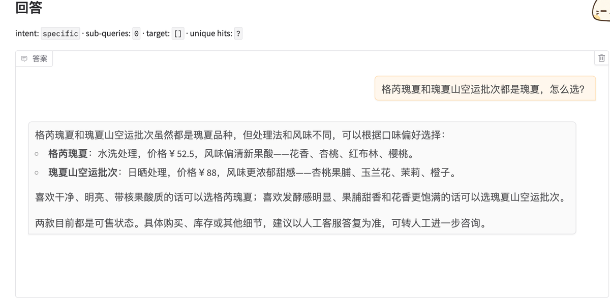
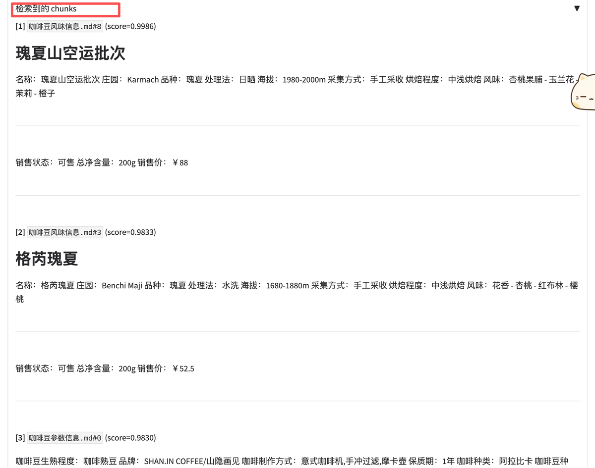
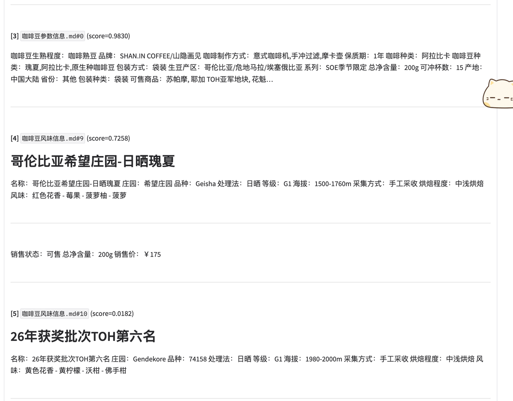
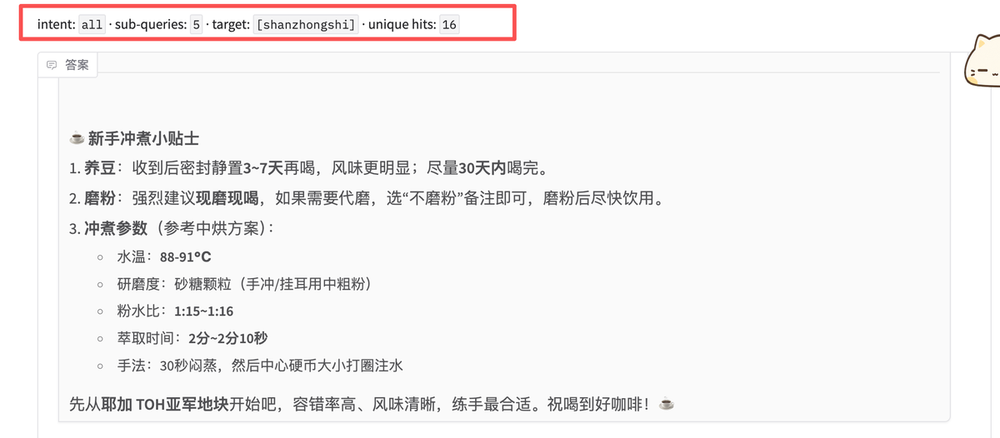
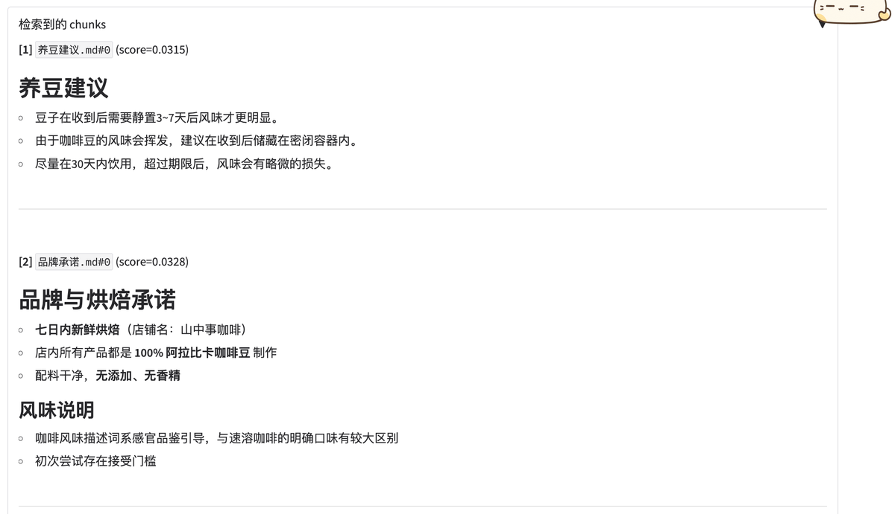
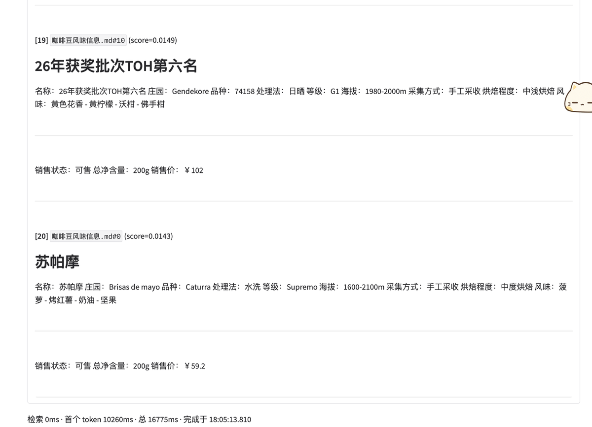
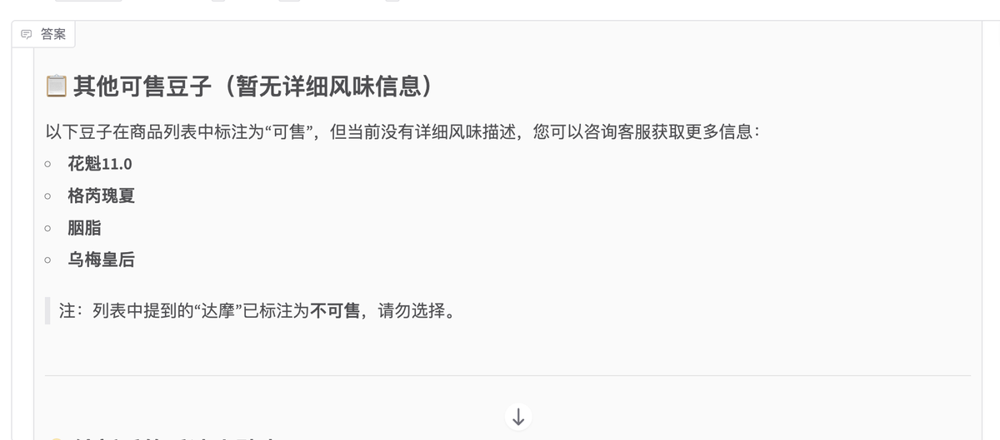

## 「RAG 入门到精通 - Classifier & Sub-... · 墨问

**「RAG 入门到精通 - Classifier & Sub-query」**

上篇中我已经给 RAG 添加 Hybrid Search 和 Reranker。现在系统在精准召回的场景中提升很明显，只要是针对单一豆子的问题，相关答案一般都在最前面（可以参考下图）。

  

可是，这样的解决方案有个很大的缺陷 - 召回的数量不足。

上面的问题是比较两种豆子，那如果问题换成“最推荐哪款给新手？”或者“哪款豆子性价比最高？”，那模型给出的答案肯定就不太对了。

那最直接的方案肯定是调大召回数量。

但是，我发现调大 RAG 的数量之后，会召回更多不相关的内容，这样会影响所有的回答。那我马上就想到了分类器，通过分类器把模型分成两个分支走不通的召回逻辑。

**Classifier**

这个分类器其实没啥，它就是让模型判断下当前的问题是哪种类型的问题，返回一个 true 或者 false。我根据分类器的结果作为条件来判断召回路径。

当分类器发现当前的问题需要对比所有商品才能给结果，那就会走 Sub-query 得到所有的豆子，以及具体需要对比的信息，然后合并所有上下文，取 top-20，再去调用大模型。

**Sub-query**

之所以需要设计一个子查询，是因为我这里考虑到模型并不一定能完全理解。

比如，“我是新手，你们哪款豆子最适合练手啊？”

这属于比较复杂的问题。其实需要先查询出所有豆子的信息，然后综合推荐。所以，需要将查询分解成一个个的子查询，每个子查询单独 RAG 一次，最后 merge 结果。

  

关于召回的是20个而不是5个，这里需要特殊说明下。如果上下文数量还是5个，那永远也解决不了全量商品信息的对比。

最合适的方式应该是一个动态的数量。在查询得到所有的商品之后，可以在最后调用模型之前动态的根据商品数量来设置相关chunks的大小。但是我这个查询场景显然没必要这么复杂，所以就写死了20。

写死数量的问题就是，召回的也不全。（比如下图中的这些商品，其实都是因为没召回的原因才这样回答）

我发现这个思路是可行的，只是需要精细化的调数据了。

0

0

0

\\n

<iframe allow="clipboard-write; web-share" src="chrome-extension://cnjifjpddelmedmihgijeibhnjfabmlf/side-panel.html?context=iframe"></iframe>