## 「RAG 入门到精通 - 一次完整的评估过程」 · 墨问

**「RAG 入门到精通 - 一次完整的评估过程」**

前面两篇文章都是在讲系统的构建，现在自己构建的系统基本上已经能构成一个闭环。但是，真正需要做的事儿才刚开始呢。

系统的构建本质上是为了服务于整个业务流程，我们不能只做系统，不断的迭代、优化数据，才是让RAG系统发生质变的关键。

回到我们项目中来看。初始的三篇文档中有两篇是我抓的，“咖啡冲煮技巧”是我生成的。

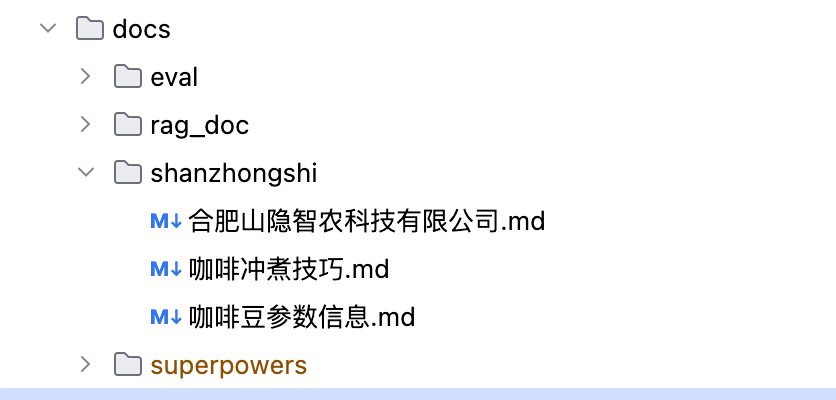

这里就会面临一个问题。 **我怎么知道现阶段我准备的数据是否足够？能满足普通顾客的日常咨询问题吗？**

**构建初始的数据集**

我借助 Agent，帮我模拟两个角色来分别回答。

首先，作为买家，从手冲新手和进阶玩家这两种角度来提问。这里的意图是，让我知道有哪些问题是咨询频率最高的。

其次，作为卖家，对这两种问题进行回答。 **先参考平时大家怎么回复的，这里不需要参考我的文档。**

之所以这样做，是因为我本身并没有标准答案。我让 Agent 给出的答案也是大家回复中最常见的，那这种模型生成的回复，我把它当作基准水平。 **我要做的是让 RAG 的回答，尽量靠近我们的基准水平。**

 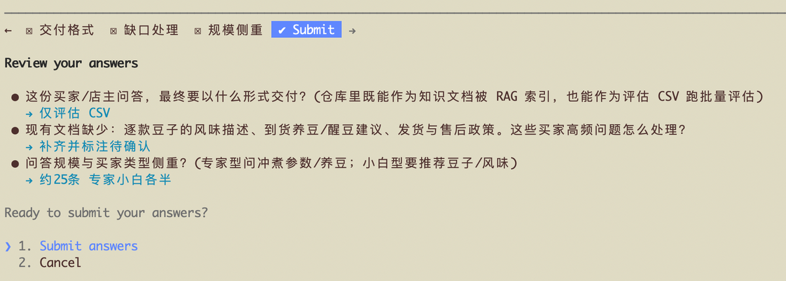 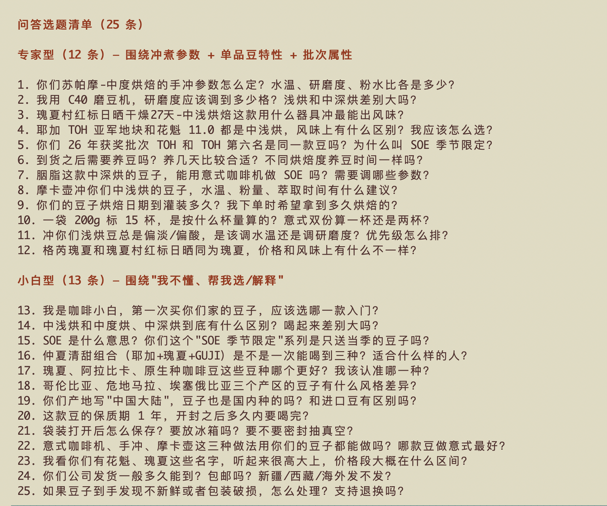 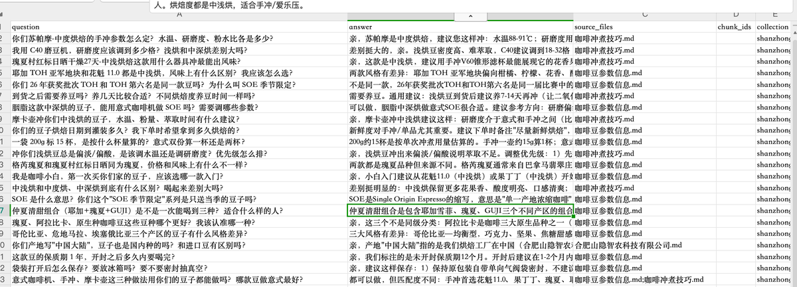

**评估并根据反馈进行改进**

接着需要将生成的CSV拿去跑评估，得到评估的结果。

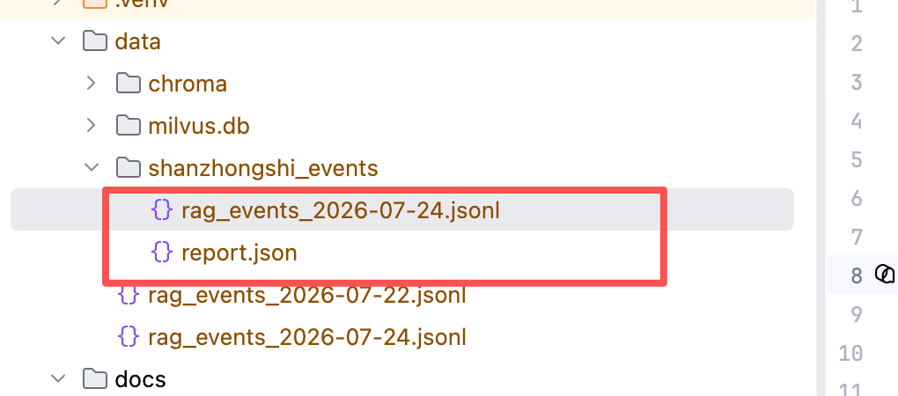 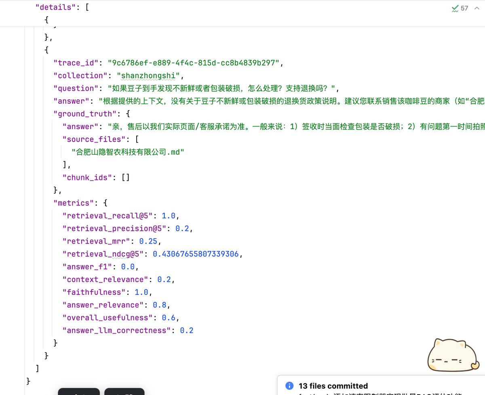

然后，再让 Agent 分析，接下来要优化的方向有哪些，给出参考意见。

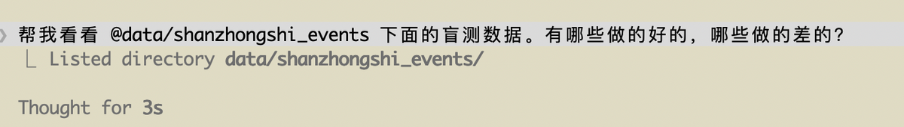 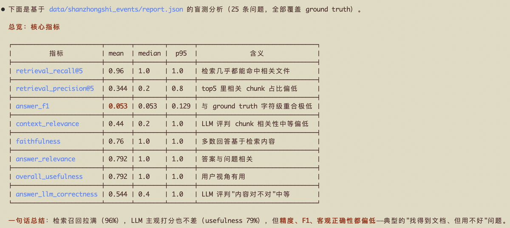 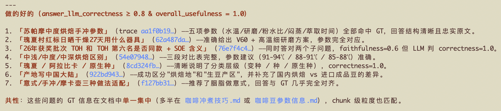 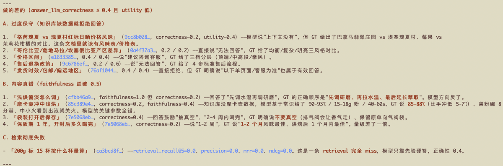 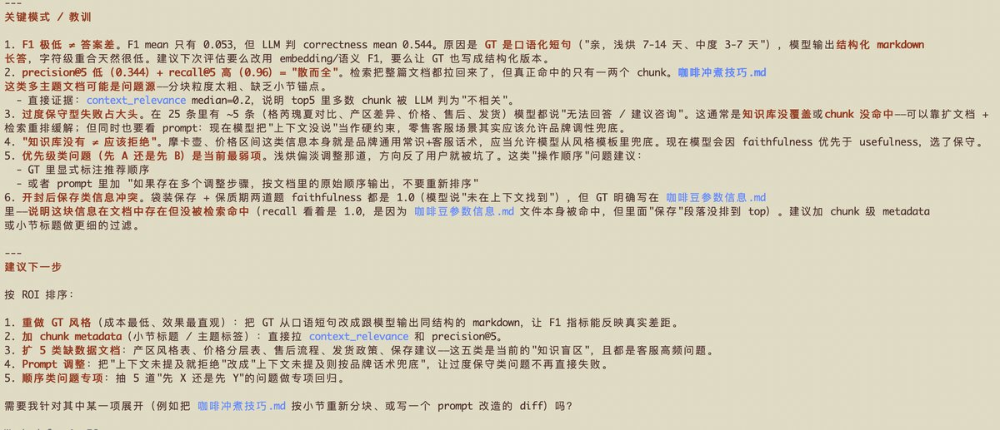

这一套下来就是一次数据评估的过程，后面就看优化的取舍了。目前我肯定希望优先补数据和加子标题，这是最简单的。

至于话术的部分，那就在说吧，毕竟我也不直到真正的话术该是咋样的啊~

0

0

0

\\n

<iframe allow="clipboard-write; web-share" src="chrome-extension://cnjifjpddelmedmihgijeibhnjfabmlf/side-panel.html?context=iframe"></iframe>