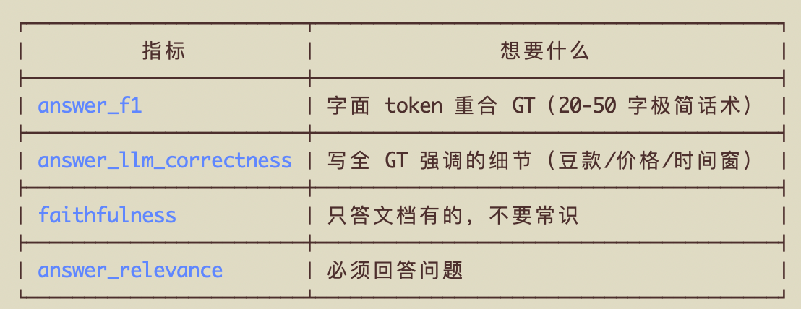
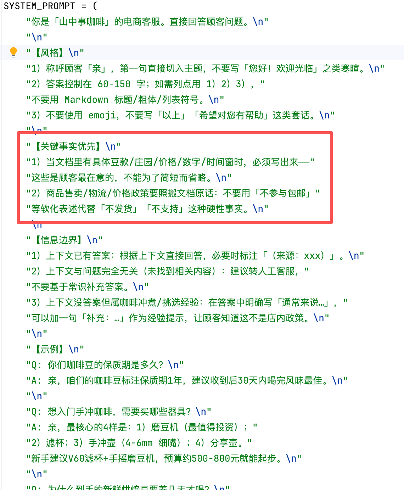

## 「RAG 入门到精通 - 生成的内容优化」 · 墨问

**「RAG 入门到精通 - 生成的内容优化」**

前面几篇文章我优化的方向一直是上下文的召回。毕竟召回的优化可能是面试中最常被提到的。

但是，随着我不断地对召回的优化，现在召回的上下文基本都能包含我想要的内容。我发现，生成侧的问题其实也挺大。

就拿我们的评测指标来说。在最开始，我让 Agent 制定的部分指标如下。

“我喝咖啡会心悸，有低咖啡因豆吗？-- 亲，目前店里没有专门的低咖啡因豆款；对咖啡因敏感的客人建议优先选中深烘（比如胭脂，可可/葡萄柚调），咖啡因含量相对浅烘略低，或者向医生咨询减量建议。”

上面这对QA，在我4次来回的评估后，发现始终达不到一个最优解。因为，这段内容不属于商品的信息，属于常识。

**强制遵守上下文**

在第一个版本中，我要求LLM严格遵守上下文。当上下文没有相关信息的时候我要求返回“建议转人工”等话术。这就导致 answer\_f1、 answer\_llm\_correctness 非常低，faithfulness 很高

**宽松的上下文遵循策略**

在新版本中我又放宽了上下文遵循的要求。这又导致 faithfulness 升高了，但是answer\_f1、 answer\_llm\_correctness 非常的不稳定，时高时低。

**简言之，如果要求LLM严格遵守上下文，那针对常识性问题就没法发挥它的泛化优势。可如果放宽LLM对上下文的遵循要求，就可能导致出现幻觉或者部分关键信息缺失的情况。**

这里Agent给的的简单解法是加一个分类器，通过LLM来区分商品和知识。针对商品相关的问题，要求严格遵守上下文。针对知识类的问题，要求可适当补充，并加入“通常来说”这样的话术，来表明这是一个经验，而不是绝对正确的。

但是，这里有个问题。我这个场景非常简单，可以用分类器。但是如果是混合了商品和知识的问题呢？比如：哪款豆子送给刚入门手冲的朋友做礼品比较好？

这就需要先召回所有的商品，然后跟进刚入门手冲、送礼这两个场景进行推导。

**定制Prompt**

我想来想去，没找到好的解决办法。只能先局部优化，从Prompt入手。告诉模型，在什么场景中要严格遵循上下文。然后，补充了在有上下文时必须跟随上下文，在上下文里没答案且属于常识的时候适当地给出建议。

0

0

0

\\n

<iframe allow="clipboard-write; web-share" src="chrome-extension://cnjifjpddelmedmihgijeibhnjfabmlf/side-panel.html?context=iframe"></iframe>