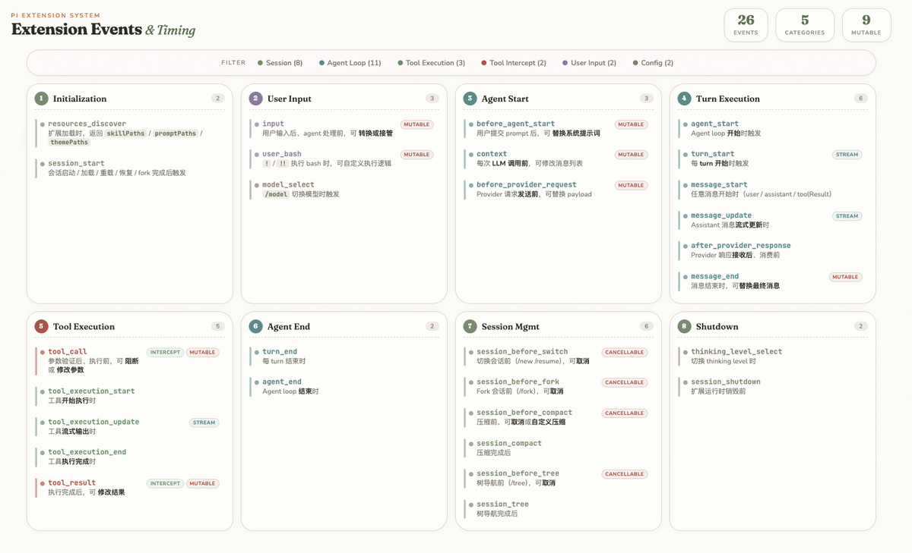
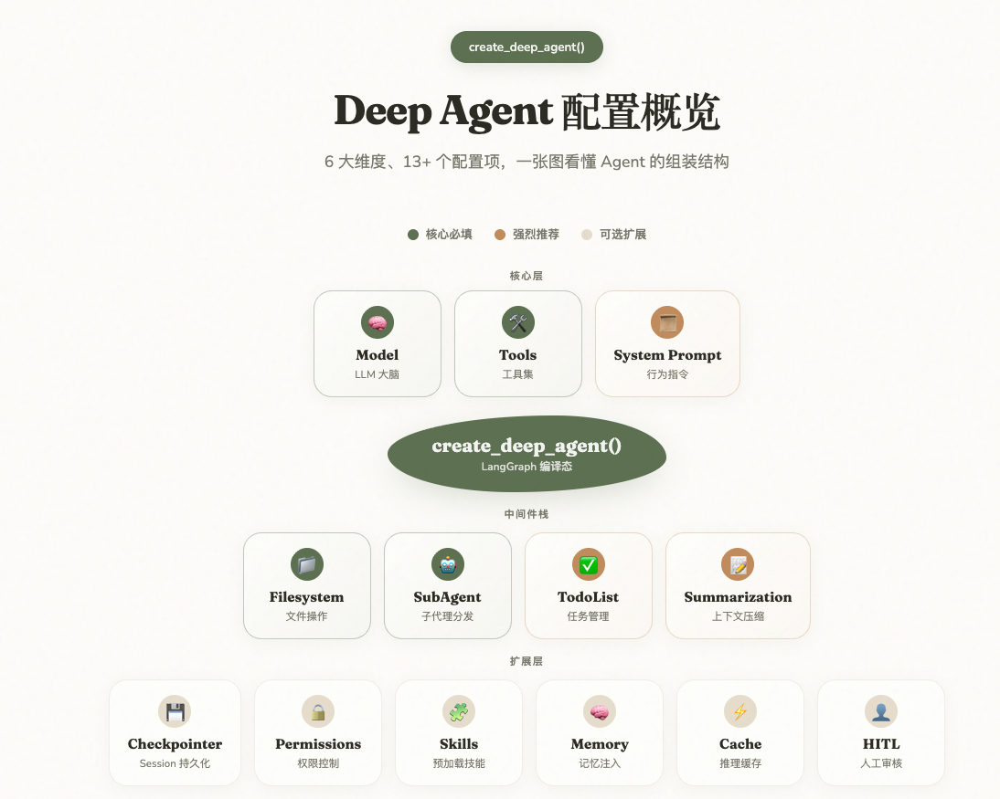
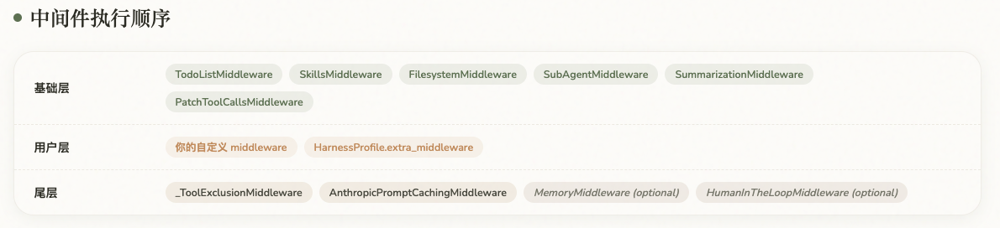
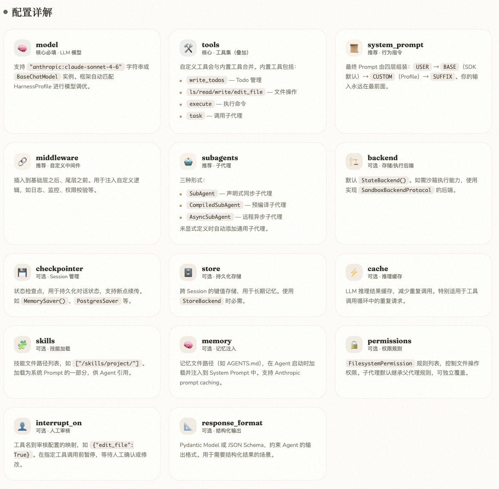

## 「“精细控制”和“开箱即用”的Agent开发路线」 · 墨问

「“精细控制”和“开箱即用”的Agent开发路线」

在开发产品时通常不太需要自己去做一个Agent。因为长尾、个性化的小需求都可以通过 Skills 的方式解决掉。

那什么时候真的需要自己开发一个 Agent 呢？

在我日常工作中，当需要用到 Agent Runtime（自主规划并且长时间可靠地运行） 并且要支持其作为一个云端服务提供时，才会去开发一个Agent。

（也许是Coding Agent和个人助理类Agent已经出现了现象级产品，当有本地Agent需求时大家默认的就去用了，不会再单独定制，而且Skill基本能满足大家的扩展需求。）

Agent要定制肯定不需要重头去写（除非你要极致的性能），我目前了解到的是有两个比较出名的开源项目分别是 DeepAgents 和 Pi。

**简单来说，如果你要极致的性能与超高自由度的扩展可以使用 Pi（TypeScript）。如果你需要的是开箱即用，Run Fast And Run First，可以使用 DeepAgents（Python）。**

**极致的性能与超高自由度的扩展。**

极致的性能是因为Pi的核心代码极致的简单。Agent Loop + Session Management + Context Compaction + Proxy Stream（LLM代理） + Execution Env 抽象 + Skills/Templates 格式化工具

其中 Agent Loop 和 Session Management 是核心，Compaction 和 Harness 是围绕它们的配套，Proxy/ExecutionEnv/Skills 是扩展支持。

同时，在此基础上，提供了20+个扩展点，可以在任意时刻进行拦截或修改。（以下是各个扩展点，从1开始按照顺序往后）

**Run Fast And Run First**

简单来说就是开箱即用，抽象程度很高。不需要你懂太多Agent运行的各个实际，你只需要告诉我Tools + LLM Provider + 内置功能（todo、skills、subagents、compaction、human in loop等等）

  

Pi确实很简单，但是要构建一个Agent出来需要极强的软件设计能力，你需要明确知道你需要什么功能以及这些功能如何做。但好在Pi维护了一个社区，里面很多基于Pi的扩展包.

我建议 **如果是想学习一个Agent，可以从 Pi 开始。而如果时间紧任务重，可以尝试 DeepAgents。**

\---相关链接

Pi: [https://github.com/earendil-works/pi](https://github.com/earendil-works/pi)

Pi 插件社区： [https://pi.dev/packages](https://pi.dev/packages)

DeepAgents: [https://github.com/langchain-ai/deepagents](https://github.com/langchain-ai/deepagents)

0

0

0

\\n

<iframe src="chrome-extension://cnjifjpddelmedmihgijeibhnjfabmlf/side-panel.html?context=iframe"></iframe>