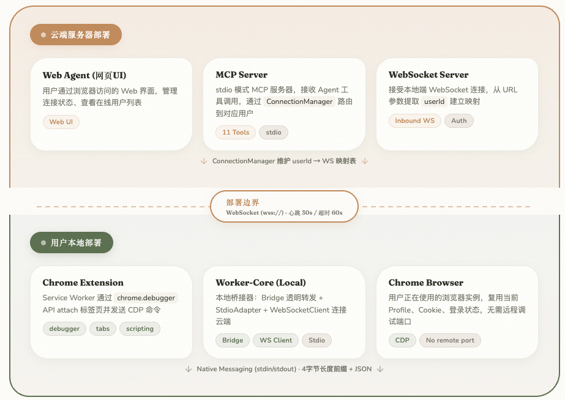
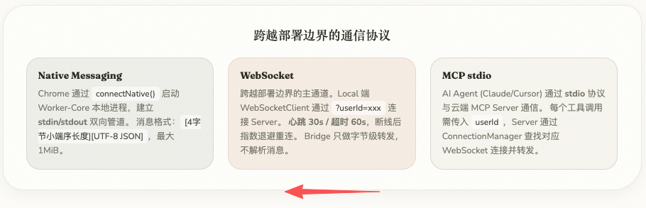

## 「云端Agent如何使用你本地机器的浏览器？」 · 墨问

**「云端Agent如何使用你本地机器的浏览器？」**

上篇讲到 Codex 的 Chrome 插件可以解决登录态的问题。

昨天我反复思考，发现这些插件设计出来的前提是 Agent 一定要运行在本地（必须要使用 Codex App）。于是我不停地反问自己，有没有云端Agent能使用本地浏览器的方式？这种场景会有吗？

**云端Agent使用你的浏览器并不是不可以，做起来也不麻烦。**

（我一下子没画出来什么好图，将就着看吧~~）

**核心在于，用户本地和云端都需要一个 WebSocket 管理的后台进程。**

首先，因为云端 Agent 需要使用用户端的浏览器，那一定是云端 Agent 向用户端发送“请求”。

我们如果把用户侧设计成服务端，那就必须要求用户端暴露一个公网IP，云端Agent去连接它，这是肯定不现实的。那只能反过来，必须是云端推送给用户端一个浏览器使用的消息，用户端去“处理”这个消息。所以，云端必须要作为WebSocket的服务端，用户端来连接。

云端 Agent 和 本地浏览器 交互的方式如下：

云端 Agent -> MCP Server -> WebSocket(Server) -> WebSocket(Local) -> Chrome

从右往左看

当然，可能会有些过度设计（或者说设计上的 **Trade Off** ）。

\- 是否真的需要将 MCP Server 和 WebSocket Server 设计成两个独立的进程？

\- 为什么一定需要 MCP Server 而不是将 WebSocket Server 的连接管理能力通过 CLI 来暴露？

**重点：这个系统其实重点不在于怎么设计通讯方式，而是云端 WebSocket 的管理问题的设计。**

\- WebSocket 连接何时建立，何时销毁？

\- 如何安全建立连接，以保证WebSocket连接和用户绑定？

\- 在使用 WebSocket 来控制浏览器时，不同session之间如何避免浏览器使用的冲突？
