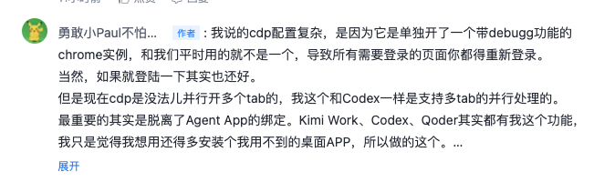

## 「从一条用户评论到Browser Bridge的新功能-Tab隔离」 · 墨问

**「从一条用户评论到Browser Bridge的新功能-Tab隔离」**

昨晚，在掘金、知乎、CSDN上发了篇帖子，本意是想讨论 Browser Bridge 这个产品有没有人愿意用的问题。属于是向广大网友取经，看看有没有什么产品上的启发。

结果，过了一个小时，只有在掘金上是真有人在看，也回了我的帖子。知乎和CSDN也有人回，也挺快，但都是AI在回（虽然我最近也是在做AI工具，但还是不得不吐槽一下）。

说回到这个帖子的事儿。

最开始的回复我也觉得挺莫名其妙的。

“你这个也要不少配置啊”

我不清楚他怎么个意思，我的产品明明不需要任何配置啊。

所以我耐心地做了下面的解释。

言外之意，并不是我的产品要配置很多东西。而是，不用我的产品的话，要在Agent里面使用浏览器就需要额外配置很多。

本来这些话，也没什么。

可是，在洗澡的时候，我不断地想。我这不就把我产品优化的方向找到了吗？

我的竞品是 Codex、Kimi Work，我的优势就是不绑定任何 Agent，那我现在的基础版本已经基本实现了。那剩下的，应该就是要兼容这些产品在使用浏览器时的细节，让用户感觉到和用这些产品一样的舒服。

这样想想，我背后隐藏的逻辑是，当 Browser Bridge 的体验和 Codex、Kimi Work 差别不大时，不需要绑定 Agent App 以及 能和任意 Agent 集成这两个卖点，大家就会愿意接受。

这听上去觉得是理所当然，但是总觉得产品的逻辑不应该是这样，但却也说不上奇怪在哪里。 Codex、Kimi Work 应该都是解决特定人群的特定问题，如果找不到这群人，找不到这个问题的痛点，是没法正面对抗的。那到底是什么人在使用 Codex 插件、Kimi Work呢？

这问题有点难想清楚。

不过，在使用Browser Bridge的过程中，我注意到一个具体的问题：当Agent需要同时处理多个页面任务时，tab的管理体验明显不如Codex流畅。这不，今天我就顺手优化了下。

**Tab 操作隔离**

在之前的版本中，我默认是在当前活跃的tab上处理navigate、click等请求。如果要使用多个tab同时进行页面处理，就需要显式地提示Agent。比如：打开一个新的tab，然后浏览xxx，然后填写xxxx等等

我认为， **好的体验应该是让模型能判断自己什么时候需要打开新tab，什么时候在同一个tab里面处理。同时，任务之间应该隔离起来，生命周期结束之后也应该做好收尾工作。**

基于这个思路，我升级了 Browser Bridge，最新版本 0.0.8。

这个最新的版本，目前暂时不能保证模型自己判断什么时候进行tab的隔离。所以，我采用了一个折中的方案——任务维度来隔离tab。

也就是说，当你不显式指定打开tab或者在哪个tab上操作，那默认就打开新的tab。当任务结束，由于 Agent 上下文里已经有了tab的id，因此可以直接关闭相关的所有tab。

眼前的问题，算是又解决了一个。看不见的问题，还是没想明白~

