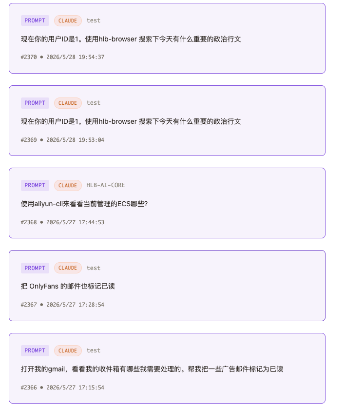
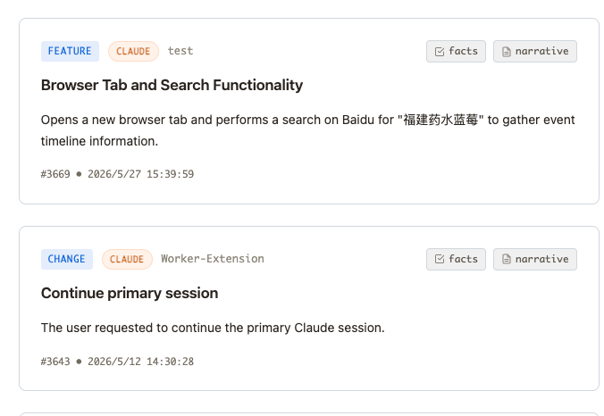
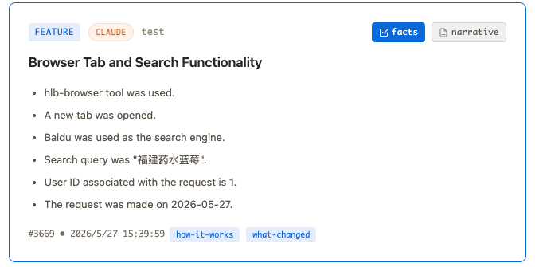
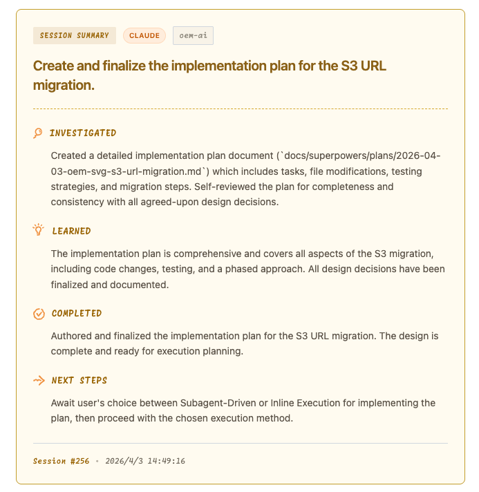

## 「省Token利器-Claude-mem」 · 墨问

**「省Token利器-Claude-mem」**

两个月前的某一天，B站 给我推了一个 Claude-mem 的视频。当时是晚上，有些不太耐烦，这个视频被我1分钟“拖”完了。具体内容是什么也没太清楚，只知道讲了个 Claude-mem，然后就关闭了。

第二天，鬼使神差般地早起了。反正也没事儿，就想起昨晚的那个视频，于是便安装了 Claude-mem。

到了今天，快两个月了。我感觉已经离不开这款产品了，有点命中注定的味道~

**WebUI**

产品没有什么高颜值，但是查看prompt历史也比较方便。

下面是针对一些复杂指令的理解。（点击 facts 可以看到他对复杂指令的理解，把其拆分成更简单、明确的指令）

 

下面是一个 Summary，对当前项目的进度、核心概念的总结。

**省Token**

它自己实现了一个 mem-search mcp。本地文件加向量检索，基本上很多上下文可以很快的查下来，省了很多AI自己去探索上下文，然后理解的过程。

这里我想澄清一点， **Claude-mem 玩的越熟练才能越省** 。

Claude-mem 省钱的逻辑在于， **避免重复的理解上下文** 。 Agent 理解上下文的过程中，不停地 tool\_call，去找上下文然后理解。虽然，LLM的API贵在输出，可是积少成多。当重复轮次多了之后，也是一笔客观的费用。

不过，这里有个陷阱。 **如果你项目做完了，后续不太会迭代，用这个东西，不能省多少 token，反而更浪费。而如果你的项目会持续迭代，那就越用越省。**

**跨Session记忆**

很多时候我们理解跨 Session 记忆时，可能就是 Claude Code 自带的项目维度 Memory。里面存一些术语、项目约束、易错点等。

但是 Claude-mem 使用了 SQLite 和 Chroma，它可以存更多。比如：我经常会问，这个项目还有哪些没做的，哪些我已经做了。昨天我做了什么？最近几天的提交有没有遗漏什么功能？

有些项目管理的味道了~~

\---附录

[https://github.com/thedotmack/claude-mem](https://github.com/thedotmack/claude-mem)

[https://docs.claude-mem.ai/installation](https://docs.claude-mem.ai/installation)
