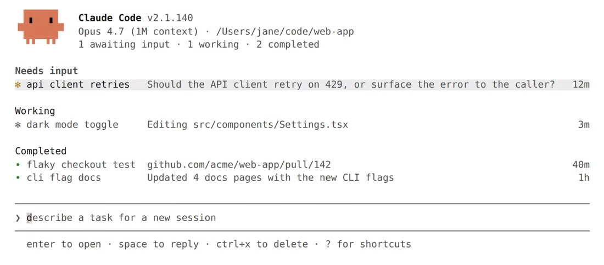
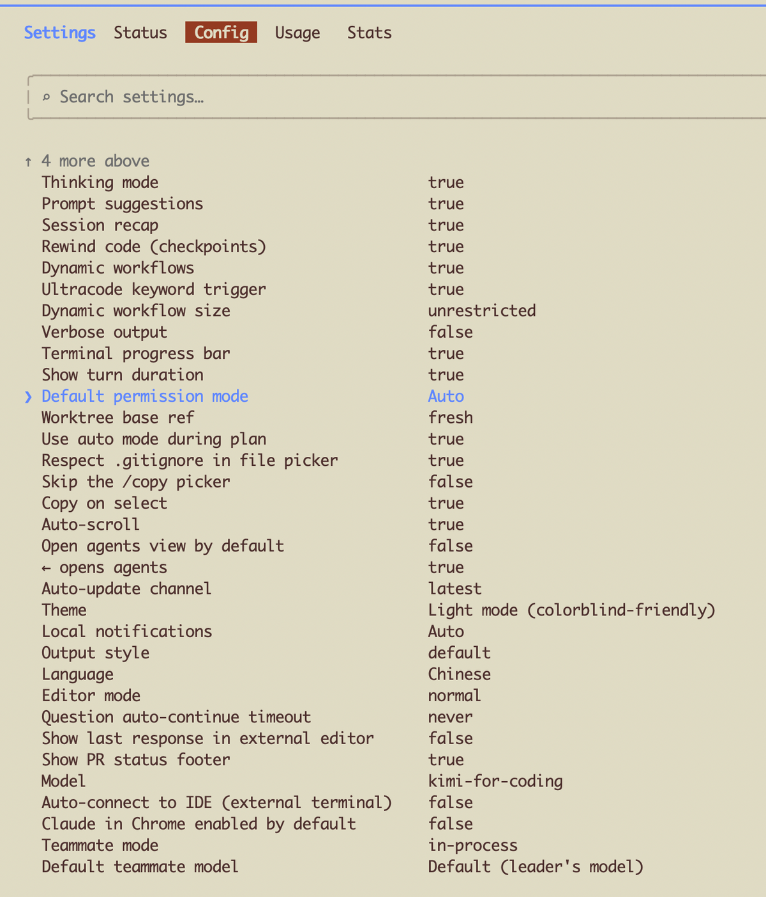
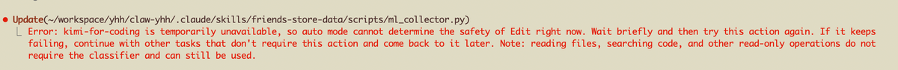

## 「自从用上 Agents View 之后， 我的心力交瘁感消失了」 · 墨问

**「自从用上 Agents View 之后， 我的心力交瘁感消失了」**

Agent View 出来得有2个月了吧，我自己也使用了1个多月。

体感上确实比之前使用 Tmux 好多了，毕竟我在用 Tmux 的时候经常吐槽不好用。

比如：原始界面不好看，还得配置一大堆样式、字体的插件。窗口折叠之后不好展开，每次展开得敲命令，敲的时候又没提示，容易敲错。在窗口内复制的内容只能在 Tmux 窗口之间粘贴，Mac 粘贴板根本获取不到，导致有时候想复制一些单词或者概念出来查资料学习的时候只能手敲。各种功能的快捷键设计的简直是奇葩，还得自己改，改完之后还记不住。

先说说，在使用 Agent View 之前我现在是怎么启动 Claude 的。

一般，我会先切换到项目目录，然后使用 --dangerously-skip-permissions 模式启动 Claude，通过多个 Tab 来切换工作目录。

**Agent View**

而有了这个功能之后，每次只需要输入 claude agents，即可在一个终端窗口里同时管理多个 claude 会话，而且这些会话默认后台执行，即使你锁屏了，仍然不影响运行——非常像 Tmux。这意味着我不用守着终端，可以去做别的事。

所以，现在我都是打开终端直接进入 Agents View 然后创建新的会话。

**创建新会话时默认模式**

当你创建会话之后，跑任务时会发现默认在 Manual。这个模式吧，甚至连读个文件要你确认一下，我直接切换到了 Auto，省得我还得手动改模式

**Auto 模式的坑**

如果有人和我一样使用的不是 Claude 原厂模型的话，那肯定遇到过 Auto 模式判断失败的问题。

这里就不得不吐槽下。这里的 Haiku 模型，国内厂商似乎都没有重视这事儿。我这里配置了 kimi-for-coding 是因为官方文档根本没有说对标的模型是什么，然后我只能让 kimi 自动路由。

而且，我看其他国内模型，似乎都是把上一个版本的模型拿来当 Haiku 用，感觉还是不太行，体验不太好。

但无所谓啦，虽然判断偶尔不准，但大部分时候能跑通，也就先这么用着，至少不用人盯梢，Agent 任务进度一目了然。可以不再那么紧张啦，泡个茶，慢下来，规划下接着要做什么。

