## 给大家安利一个在Agent时代能省钱的浏览器管理工具

最近在思考，自己写的 Browser-bridge 该怎么推广。

想来想去，没思绪。

打开google，搜索自己的项目 "browser-bridge"。

第一页，没有我。

第二页，也没有我。

第三页，还是没有我。

到了第十页，我开始问自己到底在期待什么。

**深吸一口气，回到第一页，我点开第一个搜索结果“pinchTab”。**

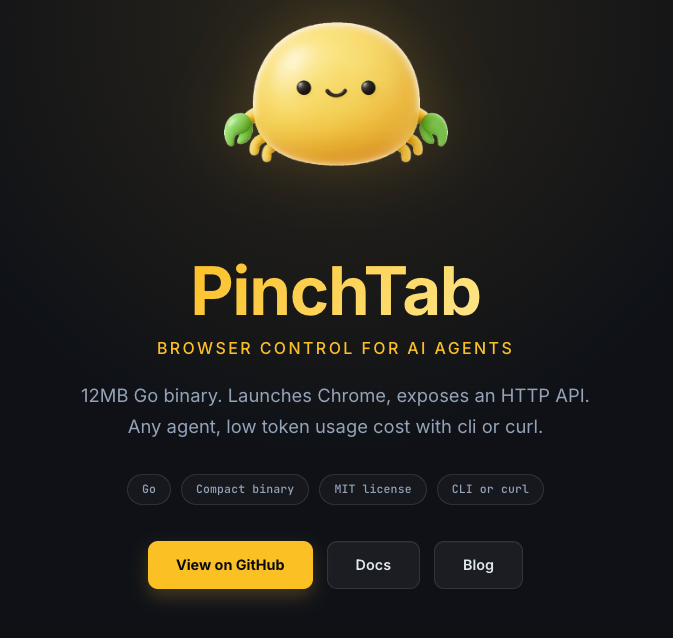 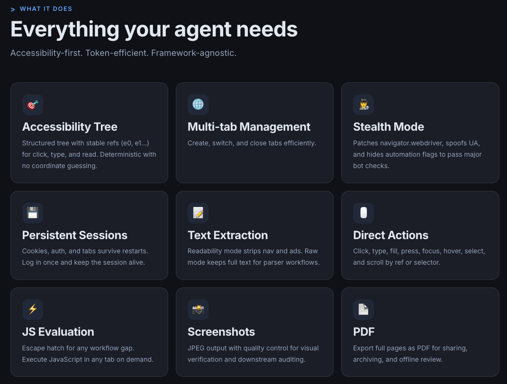

名字和介绍里面和Browser-bridge一点边都不沾。怎么排在第一个？这小螃蟹难道是和Browser-bridge一样的东西？

本地安装之后，体验了一圈。

我长叹了一口气，顺便扭头看了看外面平静的湖水。

**不过，pinchTab 确实做的很好，忍不住来安利它。**

pinchTab 不直接控制原本的Chrome实例，而像个Chrome管家，只负责管理Chrome CDP实例（cookie、浏览器生命周期、安全）、精简Chrome返回的结果（使用更加适合Agent读取的格式，而不是HTML原始格式）

## 浏览器安全

这里提到的浏览器安全可不仅仅是chrome实例的隔离。它还提供了网站访问白名单、网页操作和JS的执行、文件上传（下载）等的拦截选项。

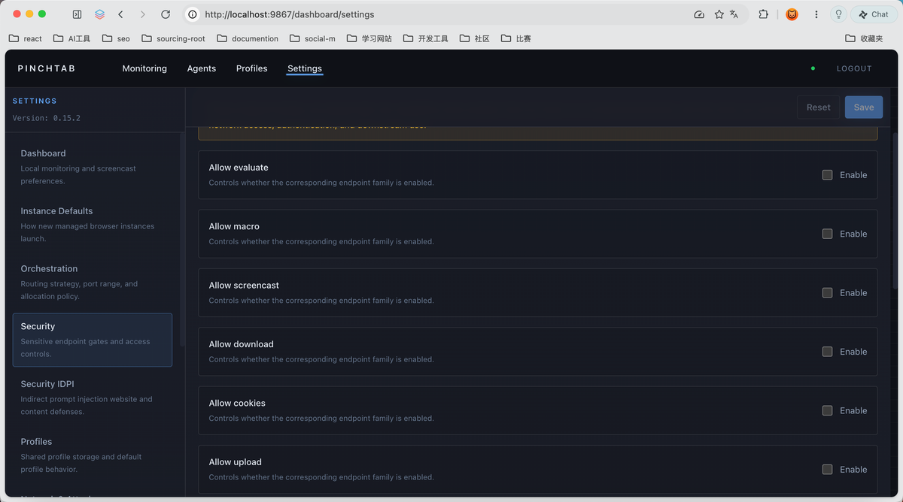

## 多实例管理

使用 Chrome CDP 时，最麻烦的是没有一个集中的管理工具。龙虾做了个TUI工具有这功能，但我在用的时候总觉得少了点味道。看了 pinchTab 之后我才明白，TUI 不够直观，龙虾的很多命令还得记住不然用起来也不方便（得去网上搜，或者让agent帮你看。而浏览器管理需求是给人看的，不是给Agent，所以觉得TUI不够好）。

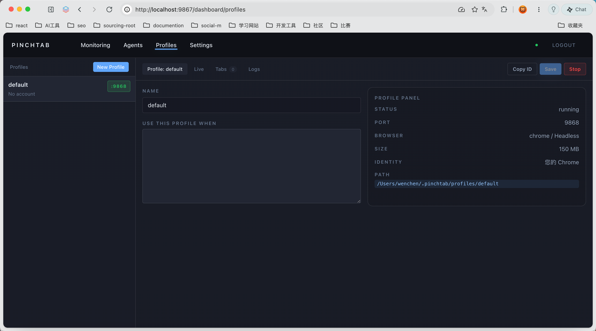

而 pinchTab 的这个UI就很简单，浏览器的数据存在哪里、有多少数据，一目了然。

这个点在清理磁盘数据的时候还是很有用的，Agent 时代下磁盘变得更重要了，因为经常不够用。人需要直观的看到，然后快速判断清理与否。

## 精简页面结构（Accessibility Tree）

我之前在用Agent来读取页面时，发现token消耗的特别快。因为工具返回的通常是整个网页的HTML源码，很多js和css样式其实是对当前任务没有用的。而 pinchTab 返回人类可读（Agent友好）的结构，比如json，或者md。

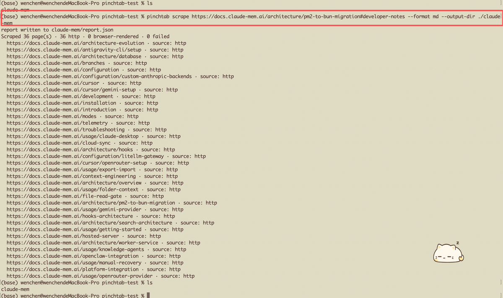 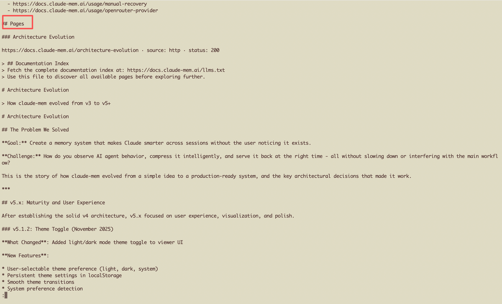 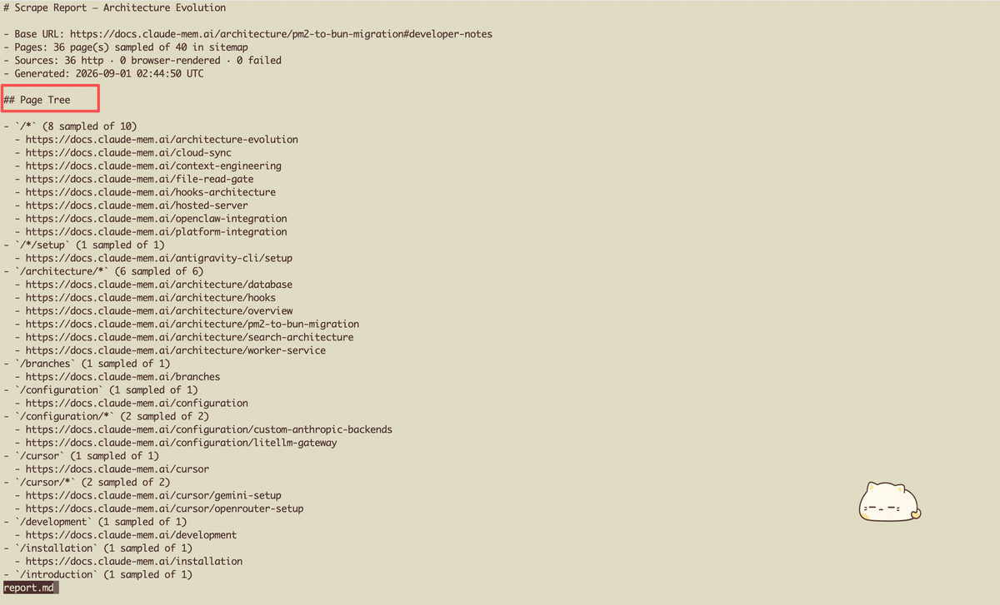

这里，有个很重要的一个知识点。Chrome 本身也是提供了 Accessibility Tree 这个功能，只是默认是关闭的，需要打开。 **而且，Chrome API 也提供了这个功能。** （这点很重要，因为我可以朝着方面来优化Browser-Bridge）

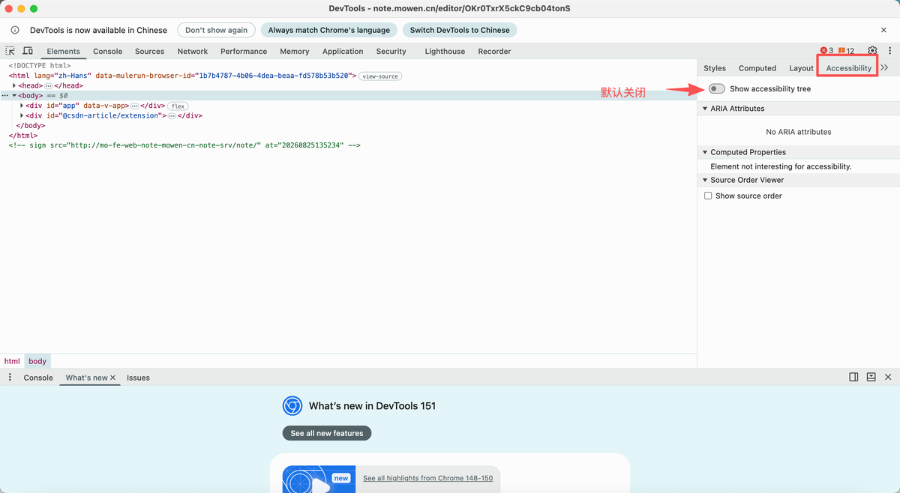 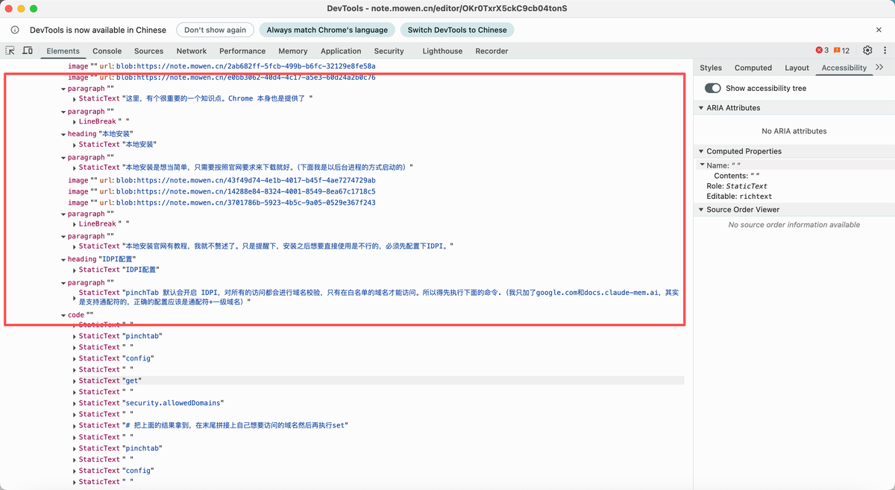

## 本地安装

本地安装是比较简单的，只需要按照官网要求来下载就好。（下面我是以后台进程的方式启动的）

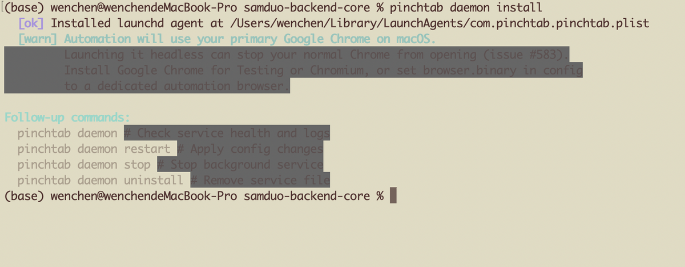 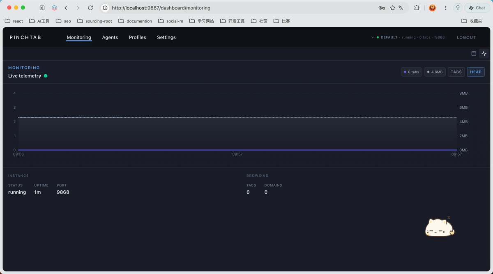 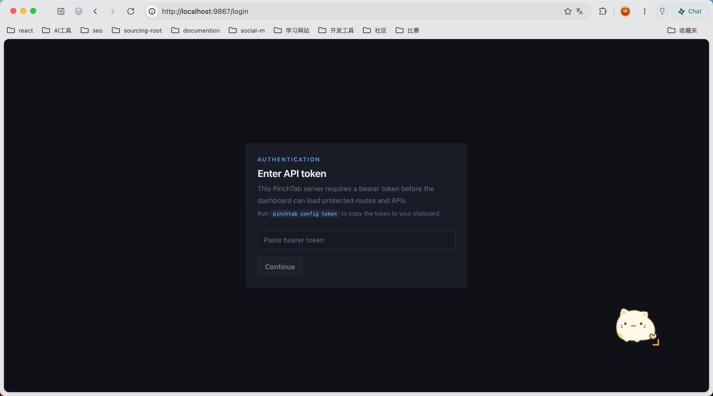

本地安装官网有教程，我就不赘述了。只是提醒下，安装之后想要直接使用是不行的，必须先配置下IDPI。

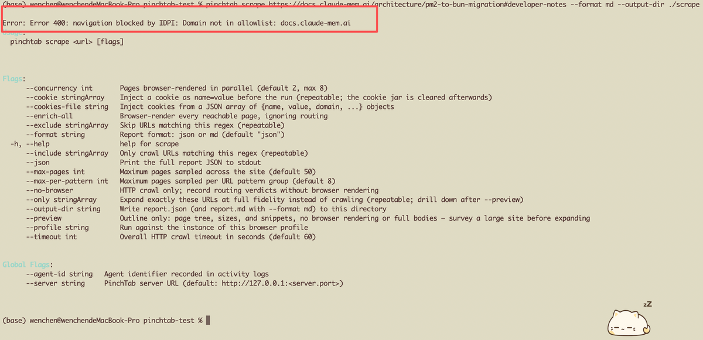

### IDPI配置

pinchTab 默认会开启 IDPI，对所有的访问都会进行域名校验，只有在白名单的域名才能访问。所以得先执行下面的命令.（我只加了google.com和docs.claude-mem.ai，其实是支持通配符的，正确的配置应该是通配符+一级域名）

```
pinchtab config get security.allowedDomains

# 把上面的结果拿到，在末尾拼接上自己想要访问的域名然后再执行set
pinchtab config set security.allowedDomains 127.0.0.1,localhost,::1,www.google.com,docs.claude-mem.ai

pinchtab deamon restart

pinchtab scrape https://docs.claude-mem.ai/architecture/pm2-to-bun-migration#developer-notes --preview

pinchtab scrape https://docs.claude-mem.ai/architecture/pm2-to-bun-migration#developer-notes --format md --output-dir ./claude-mem

pinchtab nav https://docs.claude-mem.ai/architecture/pm2-to-bun-migration#developer-notes
```

### 集成mcp

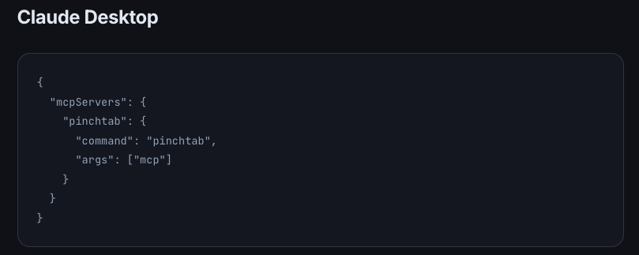

**提醒下，如果之前安装过 chrome-mcp,那默认的数据抓取仍然走 chrome-mcp，需要在会话中明确指明走 pinchTab 才行。**
