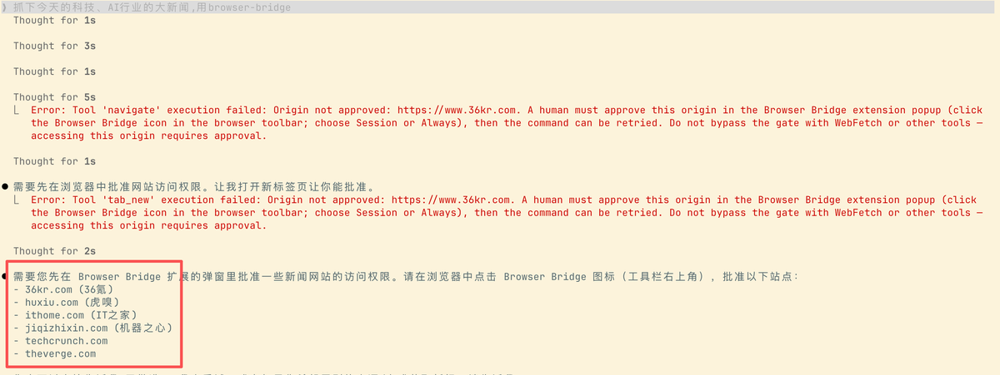
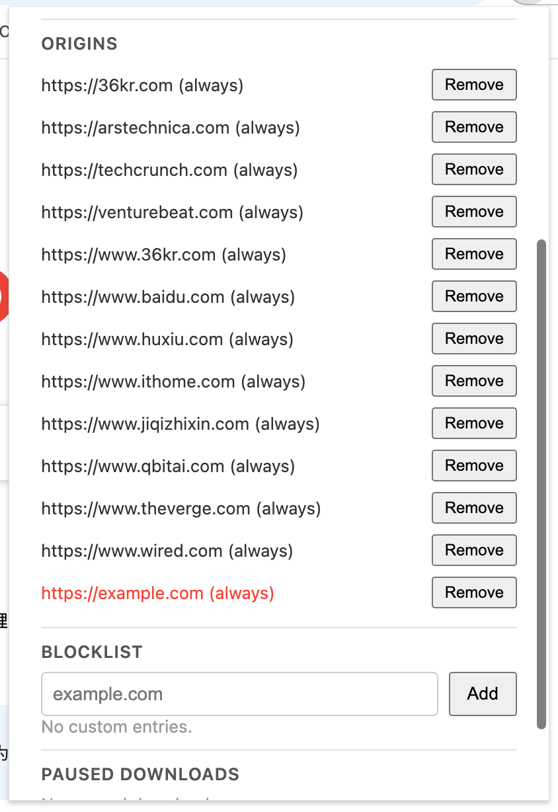

## 浏览器插件的人机交互方式思考

当使用 Agent 来控制你的浏览器时，会不会担心 Agent “不小心”给你点错了点什么？

对照着我自己做的产品，我在思考“是不是现在的权限给的太高了？哪些操作的权限需要限制？”

### 直觉-获取信息是安全的

单从用户的视角来看，浏览器的动作只有访问网页、获取信息、点击、截屏、下载。从这些动作里面我第一时间想到的是要给点击和下载添加一个权限控制，需要用户确认当前操作是否合法。

访问网页和截屏这两个动作，在我的认知中应该是最安全的，因为他们是不会副作用的一个动作。

访问网页不是 fetch，不用担心访问一个陌生的url，然后莫名奇妙的下载东西，导致电脑中病毒。

截屏更是的，就只截个图，能有啥问题？

### 反直觉-安全需要区分具体场景

**敏感信息的保护，** 我忽略掉了敏感信息的保护。试想一下，你让Agent帮你抓你和你上一家公司的信息，再结合你的提供最近的工作经历，生成一份简历，最后帮你投递到Boss直聘上心仪的公司。

如果，访问了银行后台怎么办？给你来个数据抓取或者截屏，然后变成附件投递到人家邮箱里去了，这咋办？

### 直觉-点击是不安全的，应该限制

我记得今年年初，Claude Code 刚火的时候。国外有个小姐姐，用它来筛选自己的邮件，结果因为上下文压缩，把“不允许删除”这条信息给压缩了。结果，有部分邮件被删了。

想到这里，我就觉得得限制按钮的点击。

### 反直觉-安全与否应该交由用户判断

我如果一刀切，所有按钮的点击都被拦截，那遇到需要点击，跳转才能获取到信息的页面，就直接卡住了。比如：淘宝商品信息，得先从列表页获取基础数据，再进入详情页获取更详细的商品信息。

这些场景，我没法穷举出来。

这里，似乎有个根本的问题，产品的安全边界在哪里？

这里，我想的还不是很清楚。

### 安全策略只做能做到的

目前我能做的是，拦截能对 Chrome 产生影响的动作。

比如：访问 Chrome 配置页。即 chrome://、chrome-extension:// 和 file:// （担心与越权访问本地文件访问本地文件）

### 人机交互的设计

目前是在Agent使用过程中直接返回“Origin not approved”，并提示去插件里面授权。

 

PS：这个解法倒不是不行，只是感觉用起来有点麻烦。Agent 失败之后，停下来。然后授权，再继续~~

字数 953 / 20000

<iframe allow="clipboard-write; web-share" src="chrome-extension://cnjifjpddelmedmihgijeibhnjfabmlf/side-panel.html?context=iframe"></iframe>