## 「复刻Codex浏览器插件-实现篇」 · 墨问

其实在上一版中，我已经基于 python + ts 实现了一版，这一版我讲讲踩过的一些坑。

**项目结构真的非常影响效率**

上一版中我的 python + ts 在两个不同的目录，导致调试或者编码的时候其实 Agent 也拿不到上下文，写出的代码基本不能运行。

最经典的例子就是通讯协议的设计。两边连通讯协议都不统一，而由于在第一版中已经不统一了，修复的时候只能 case by case，就很慢。

**这次，我用了 Monorepo，并且统一使用 ts 编写。** 把通讯协议放到共享项目目录下，这样基本不会有通讯协议的问题。（或者说在编码的时候 Agent 能直接检查出来问题，调试都不用了）

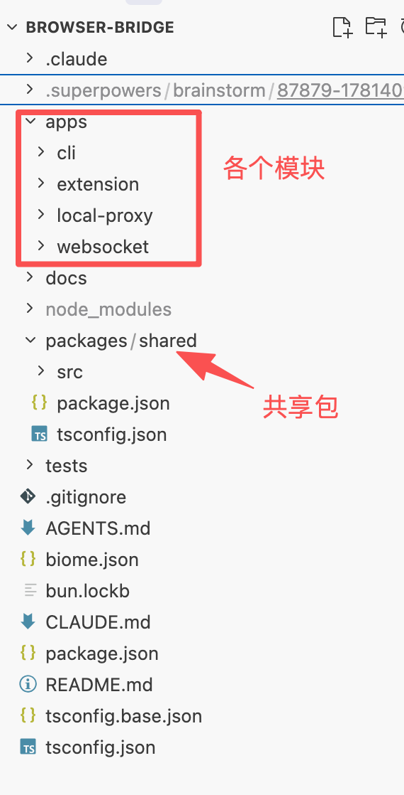

**重大的功能使用 Super Power 还真不一样**

并不是说 Super Power 万能。我想说的是，在项目设计初期，brainstorming 会帮助你厘清很多你自己还没想清楚的概念，检查出来你遗漏的点。

最总要的一点是，Super Power 在新版本中添加了网页端。Agent 在给你方案的时候除了给你简短的几句话之外，还会给你举例说明（通过 http://localhost:56666可以看到 不光概念，而且还有例子及重点，分的真的很清楚，很好理解）。

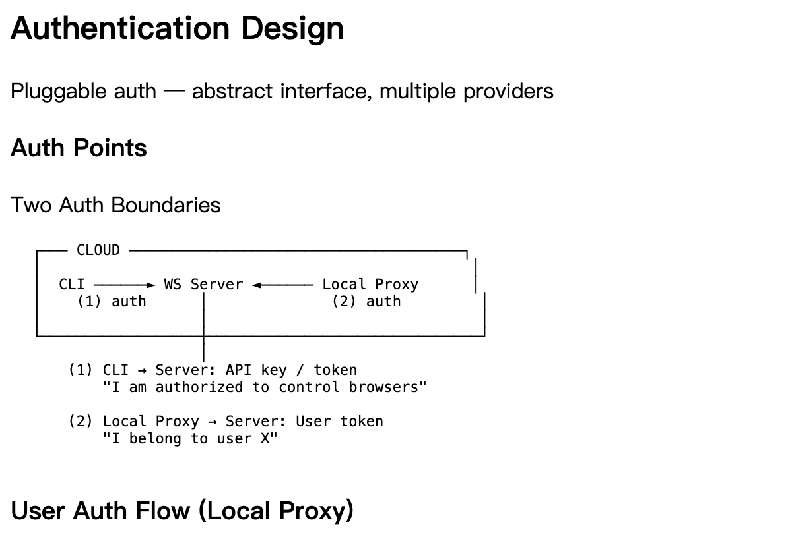 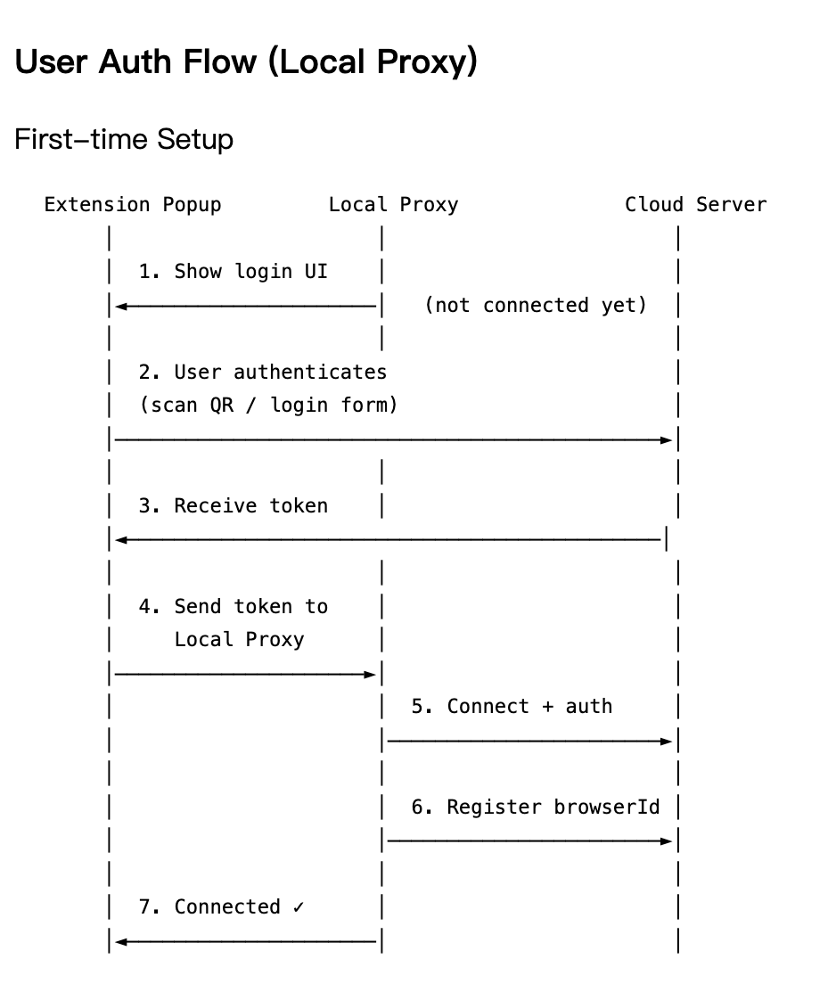 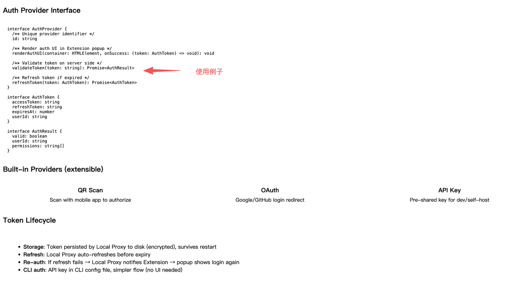

1/3

**Service Worker 默认30s会进入睡眠**

本来以为是老问题。chrome 插件的 popup页面里的代码会随着插件面板的打开而创建，关闭则立即销毁。之前的代码是写在 popup 里面的，导致面板一关闭就会自动断掉 ws 连接。

但今天遇到的是 Service Worker 默认30s休眠，需要单独抽离一个 offscreen.html

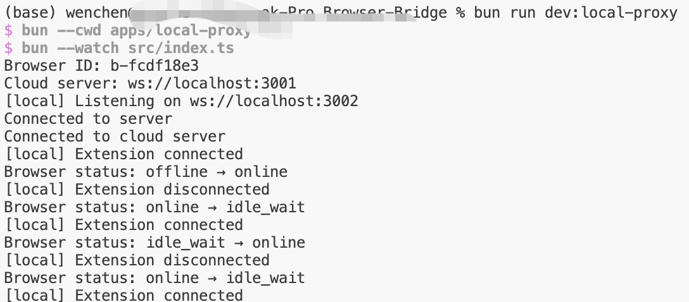 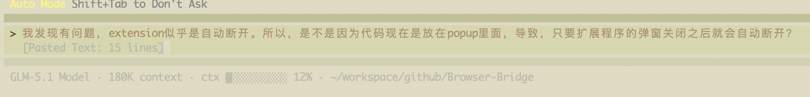 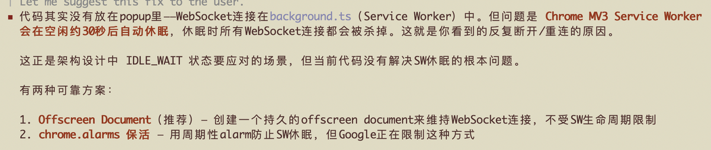 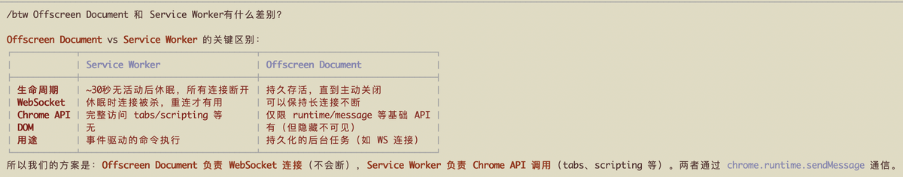 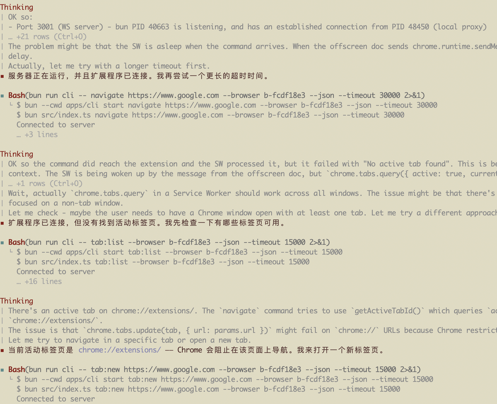

1/5

**附录**

这是我产品设计的文档，我用 GLM 5.1 出来，基本就能跑。唯一的问题就是上面的 offscreen 问题，有兴趣的可以参考下。

```
# Browser-Bridge System Architecture Design

Date: 2026-06-12

## Goal

A cloud-deployed CLI that lets AI Agents remotely control a user's Chrome browser. The Agent issues fine-grained atomic commands (navigate, click, type, extract text), which are routed through a WebSocket server to the user's local machine, where a Chrome Extension executes them using the user's real browser session.

## Deployment Architecture

Two deployment zones:

### Cloud
- **CLI** — AI Agent interface. Outputs structured JSON with \`--json\` flag.
- **WS Server** — Authenticates local proxies, routes commands by \`browserId\`, maintains connection registry.

### Local (user's machine)
- **Local Proxy** — Always-on binary. Maintains persistent WS connection to cloud server, exposes local WS server for the Extension, buffers commands during Service Worker sleep gaps (max 5s), authenticates once on startup.
- **Chrome Extension** — Connects to Local Proxy via \`ws://localhost:PORT\`. Handles tab/navigation commands directly, forwards DOM commands to content scripts.

### Data Flow

\`\`\`
AI Agent → CLI → WS Server → Local Proxy → Extension → Browser
                                              ↑
                                    ws://localhost:PORT
\`\`\`

## Key Design Decisions

| Decision | Choice | Rationale |
|---|---|---|
| Extension ↔ Local Proxy | Local WS (not Native Messaging) | Native Messaging is extension-initiated; Chrome may kill the host process when SW sleeps. Local WS lets the always-on proxy maintain the cloud connection independently. |
| CLI communication model | Multiplexed WS | One persistent WS connection, \`--browser <id>\` per command. Supports multi-browser routing without per-command connection overhead. |
| Command granularity | Fine-grained atomic operations | Each command maps to a single browser action. Orchestration is the Agent's responsibility. |
| CLI interface | CLI + \`--json\` (not MCP) | Zero persistent token overhead when not in use. Structured output guaranteed with \`--json\` flag. MCP can be added as optional wrapper later. |
| CLI → Server auth | NoopAuthProvider (same machine) | CLI and WS Server co-deploy; localhost is trusted. Interface reserved for future remote server scenarios. |

## Protocol & Routing

### Message Envelope

All messages use a unified JSON envelope:

\`\`\`json
{
  "id": "uuid",
  "type": "command | response | event",
  "browserId": "b-123",
  "payload": { ... },
  "timestamp": 1718000000
}
\`\`\`

- \`id\` correlates request → response.
- \`type\` distinguishes commands, responses, and async events.
- \`browserId\` is the routing key at the server.

### Browser Online State Machine

\`\`\`
                 connect                disconnect
            ┌─────────────►  ONLINE  ──────────────┐
            │                                  Chrome closed
            │               SW sleeps               │
            │                  ▼                     │
            │             IDLE_WAIT                  │
            │            (buf: ~5s)                  │
            │                  │ timeout             │
            │                  ▼                     ▼
            └─────────────  OFFLINE  ◄──────────────┘
                     Chrome reopens
\`\`\`

- **ONLINE**: Extension connected, commands execute immediately.
- **IDLE_WAIT**: Service Worker briefly asleep. Local Proxy buffers 1 command for up to 5 seconds. If SW wakes, command is delivered. If timeout, error returned to CLI.
- **OFFLINE**: Chrome closed or Extension disconnected. All commands rejected immediately. No buffering.

### Browser Registration

1. Local Proxy starts → connects to WS Server with auth token.
2. Server validates token → extracts \`userId\`.
3. Proxy sends \`register\` message with \`browserId\` (generated on first run, persisted to disk).
4. Server adds entry: \`browserId → { userId, wsConnection, status }\`.
5. Proxy reports online/offline as Extension connects/disconnects.

### Routing Flow

1. CLI sends command with \`browserId\` to WS Server.
2. Server looks up \`browserId\` in connection registry.
3. If browser is **offline** → return error immediately.
4. If browser is **online** → forward command to the Local Proxy's WS connection.
5. Local Proxy forwards to Extension.
6. Extension executes command, returns response.
7. Response travels back: Extension → Local Proxy → WS Server → CLI.

## CLI Design

### Global Flags

\`\`\`
--server <url>     WS Server URL (default: from config)
--browser <id>     Target browser instance (required for most commands)
--json             Structured JSON output (for Agent consumption)
--timeout <ms>     Command timeout (default: 10000)
\`\`\`

### Command Set

| Category | Commands |
|---|---|
| Navigation | \`navigate <url>\`, \`goBack\`, \`goForward\`, \`refresh\` |
| Tab Management | \`tab:list\`, \`tab:new <url?>\`, \`tab:close <tabId>\`, \`tab:switch <tabId>\` |
| DOM Interaction | \`click <selector>\`, \`type <selector> <text>\`, \`select <selector> <value>\`, \`scroll <selector\|page> <x> <y>\`, \`hover <selector>\` |
| Data Extraction | \`gettext <selector>\`, \`gethtml <selector>\`, \`screenshot <selector?>\`, \`pageinfo\` |
| Wait / Utility | \`wait:element <selector> --timeout <ms>\`, \`wait:navigation --timeout <ms>\` |

### Element Targeting

- **Primary**: CSS Selector — \`click "button.login"\`, \`type "#email" "user@example.com"\`
- **Fallback**: Text match — find by visible text when selector is unreliable

Agent workflow: call \`gethtml\` or \`pageinfo\` to inspect the page, then use selectors in subsequent commands.

### Output Format

Human (default):
\`\`\`
$ mycli navigate https://example.com --browser b-123
Navigated to https://example.com
Title: Example Domain
\`\`\`

Agent (\`--json\`):
\`\`\`json
{
  "status": "ok",
  "url": "https://example.com",
  "title": "Example Domain"
}
\`\`\`

Error (\`--json\`):
\`\`\`json
{
  "status": "error",
  "error": "browser_offline",
  "message": "Browser b-123 is offline"
}
\`\`\`

## Local Proxy Design

### Responsibilities

**Cloud-facing:**
- Maintain persistent WS connection to cloud server
- Authenticate on connect (once per session)
- Register \`browserId\` with server
- Report browser online/offline status
- Receive commands, forward to Extension
- Return Extension responses to cloud server

**Extension-facing:**
- Expose local WS server at \`ws://localhost:3001\`
- Accept Extension connections
- Forward cloud commands to Extension
- Receive Extension responses
- Detect Extension disconnect → report offline to cloud
- Short buffer for SW sleep gap (1 command, ≤5s, only in IDLE_WAIT state)

### Internal Structure

\`\`\`
┌──────────── Local Proxy ────────────┐
│                                      │
│  ┌─────────────┐  ┌──────────────┐  │
│  │ CloudClient  │  │ LocalServer  │  │
│  │ WS → Cloud  │  │ WS ← Ext    │  │
│  │ Auth+Reg    │  │ Port: 3001   │  │
│  │ Auto-reconn │  │              │  │
│  └──────┬──────┘  └──────┬───────┘  │
│         ▼                ▼           │
│  ┌──────────────────────────────┐    │
│  │         Router               │    │
│  │  cloud cmd → extension       │    │
│  │  ext resp → cloud            │    │
│  │  ext disconnect → offline    │    │
│  │  ext connect → online        │    │
│  └──────────────────────────────┘    │
│         ▼                            │
│  ┌──────────────────────────────┐    │
│  │       State Manager          │    │
│  │  browserId (persisted)       │    │
│  │  online status               │    │
│  │  pending commands (≤5s buf)  │    │
│  └──────────────────────────────┘    │
└──────────────────────────────────────┘
\`\`\`

### Lifecycle

1. **Start** — Load \`browserId\` from local config (or generate on first run). Load cached token from disk if available.
2. **Start Local Server** — Listen on \`ws://localhost:3001\`.
3. **Connect to Cloud** (if cached token) — WS connect → authenticate → register \`browserId\`. If no cached token, wait for Extension to provide one (step 4b).
4. **Wait for Extension** — Browser offline until Extension connects.
5. **Extension connects** → if no cached token, Extension provides auth token → Proxy authenticates with cloud → registers \`browserId\`. Report ONLINE.
6. **Extension disconnects** → report OFFLINE to cloud.
7. **Cloud WS disconnects** → auto-reconnect with backoff.

### Command Buffer Rules

- Only buffers when browser is in IDLE_WAIT state (SW briefly asleep).
- Max buffer duration: **5 seconds**.
- Max buffer size: **1 command** (not a queue).
- If SW doesn't wake within 5s → return error to cloud, discard command.
- If browser is OFFLINE → **no buffer**, immediate error.
- Rationale: avoid "ghost execution" where buffered commands run unexpectedly when the user reopens their browser.

### Deployment

- **Development**: \`bun run apps/local-proxy/src/index.ts\`
- **Production**: \`bun compile ./src/index.ts --outfile bridge-proxy\`

## Extension Design

### Component Architecture

- **Background (Service Worker)**: Connects to Local Proxy via \`ws://localhost:3001\`. Handles tab/navigation/screenshot commands using Chrome APIs. Forwards DOM commands to content scripts via \`chrome.tabs.sendMessage\`.
- **Content Script (per tab)**: Executes DOM operations (click, type, select, scroll, hover, getText, getHtml, wait:element). Uses MutationObserver for \`wait:element\`.
- **Popup**: Displays connection status and \`browserId\`.

### Command Routing

| Command | Handler | Chrome API |
|---|---|---|
| \`navigate\` | Background | \`chrome.tabs.update\` |
| \`goBack/goForward\` | Background | \`chrome.tabs.goBack/forward\` |
| \`refresh\` | Background | \`chrome.tabs.reload\` |
| \`tab:*\` | Background | \`chrome.tabs.*\` |
| \`pageinfo\` | Background | \`chrome.tabs.get\` |
| \`screenshot\` | Background | \`chrome.tabs.captureVisibleTab\` |
| \`wait:navigation\` | Background | \`chrome.tabs.onUpdated\` |
| \`click/type/select/scroll/hover\` | Content Script | DOM API |
| \`getText/getHtml\` | Content Script | DOM API |
| \`wait:element\` | Content Script | MutationObserver |

### Content Script Injection

1. Background receives a DOM command for a tab.
2. Ping content script via \`chrome.tabs.sendMessage\`.
3. If no response → inject via \`chrome.scripting.executeScript\`.
4. Send command via \`chrome.tabs.sendMessage(tabId, command)\`.
5. Content script executes and returns result.

### Manifest V3 Permissions

\`\`\`json
{
  "permissions": ["tabs", "activeTab", "scripting"],
  "host_permissions": ["<all_urls>"]
}
\`\`\`

## Authentication Design

### Auth Boundaries

| Boundary | Auth | Rationale |
|---|---|---|
| CLI → WS Server | NoopAuthProvider (same machine) | Localhost is trusted; interface reserved for future remote server |
| Local Proxy → WS Server | User token (AuthProvider) | Cross-public-network; must prove identity |
| Extension → Local Proxy | None | Same machine, local WS, trusted |

### User Auth Flow (First-time Setup)

1. Extension popup shows login UI (rendered by AuthProvider).
2. User authenticates (scan QR / login form / OAuth).
3. Extension receives \`AuthToken\` from provider.
4. Extension sends token to Local Proxy via local WS.
5. Local Proxy connects to WS Server with token.
6. Server validates token → extracts \`userId\`.
7. Local Proxy registers \`browserId\`.
8. Extension shows "Connected".

### AuthProvider Interface

\`\`\`typescript
interface AuthProvider {
  id: string
  renderAuthUI(container: HTMLElement, onSuccess: (token: AuthToken) => void): void
  validateToken(token: string): Promise<AuthResult>
  refreshToken(token: AuthToken): Promise<AuthToken>
}

interface AuthToken {
  accessToken: string
  refreshToken: string
  expiresAt: number
  userId: string
}

interface AuthResult {
  valid: boolean
  userId: string
  permissions: string[]
}
\`\`\`

### Built-in Providers

- **QR Scan**: Scan with mobile app to authorize.
- **OAuth**: Google/GitHub login redirect.
- **API Key**: Pre-shared key for dev/self-host.

### Token Lifecycle

- **Storage**: Persisted by Local Proxy to disk (encrypted), survives restart.
- **Refresh**: Local Proxy auto-refreshes before expiry.
- **Re-auth**: If refresh fails → notify Extension → popup shows login again.

## Security Model

### Trust Zones

1. **Cloud (same machine)**: CLI ↔ WS Server over localhost. No auth needed.
2. **Public internet**: WS Server ↔ Local Proxy over WSS (TLS + token auth).
3. **Local (same machine)**: Local Proxy ↔ Extension over localhost WS. No auth needed.

### Authorization

- Server routes commands only to \`browserId\`s belonging to the authenticated user.
- CLI can only access browsers its user has permission for.
- Future: per-command permission levels, audit logging, rate limiting.

## Monorepo Structure (Updated)

\`\`\`
apps/
  cli/              # AI Agent CLI (Commander + --json)
  extension/        # Chrome MV3 Extension (Vite build)
  local-proxy/      # NEW: Always-on local proxy binary
  websocket/        # WS Server (Bun.serve)
packages/
  shared/           # Shared constants and types
\`\`\`

New app \`apps/local-proxy\` to be added. \`apps/websocket\` currently contains both server and client; the client portion will move to \`apps/local-proxy\`.
```

**show time**

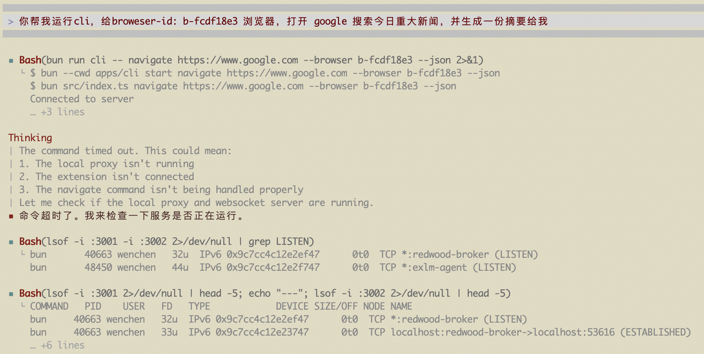  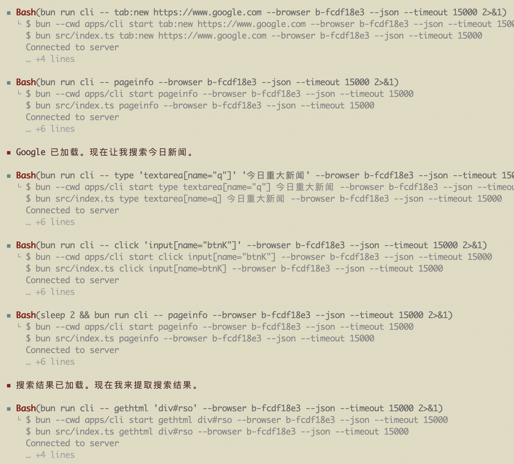 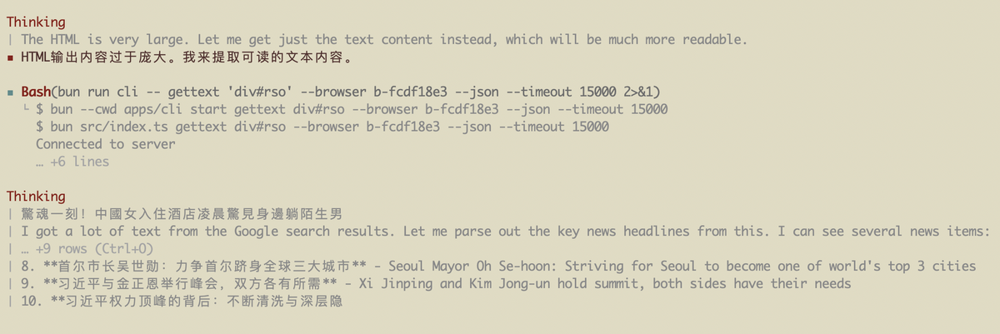

1/4
