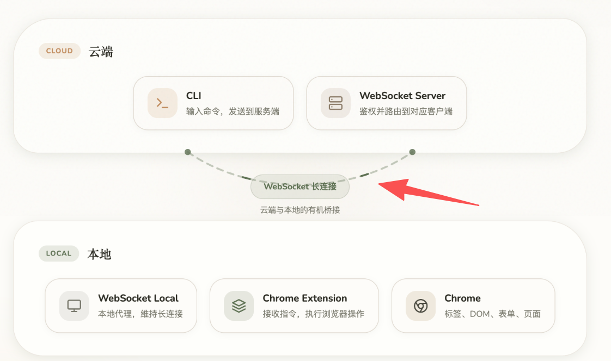

## 「复刻Codex浏览器插件-核心设计篇」 · 墨问

**「复刻Codex浏览器插件-核心设计篇」**

我一个月之前已经写过一篇文章介绍去 Codex 浏览器的一些复刻思路。不过，那个版本的思路比较混乱，实现起来有很多的概念需要进一步厘清。今天我调整了设计思路，用更简洁的方案来实现。

**产品的场景**

产品有两个使用者，分别是 Agent 和浏览器。Agent 需要通过这个产品来发送指令给浏览器，浏览器需要通过这个产品来接受指令并执行。

**产品的关键设计**

下图中的 WebSocket Server、WebSocket Local、Extension 即是我们需要设计的产品（组合）。

**WebSocket Server 和 WebSocket Local**

Agent 种类很多，有的是运行在云端的，也有运行在本地的。为了让产品能兼容者两种情况，我默认将 Agent 视为云端部署， **通过 backend service 来进行网络通讯** 。这样一来，即使你在本地，通过本地网络通讯几乎没有什么性能影响。

（WebSocket Server 和 WebSocket Local 就是backend service，它们是独立进程）

WebSocket Server 负责管理 WebSocket 连接。当接受 Agent 的指令时他会路由到对应连接，然后把指令传过去，等待执行完整后接收反馈结果。

WebSocket Local 有两个角色。一是 WebSocket Server的客户端。二是 Chrome Extension的服务端。

之所以 Chrome Extension 还需要通过 ws 来和 WebSocet Local 建连，是为了接受指令。之前是通过 Native Host 进程来通知 Chrome Extension，现在直接通过 ws 来转发 WebSocket Local 推送给他的指令。

**Chrome Extension**

主要就是接受指令，转化成对应的 Chrome API 的调用并返回结果即可。

相较于上一版本主要的变化在于， **用户在部署时不再有 Native Host 进程，取而代之的是 Local Proxy（也就是图中的 WebSocket Local）。**

**Native Host 是由 Chrome 管理的辅助进程，只要 Chrome 关闭了，那这个辅助进程也就被 kill 了。** 这样，其实 WebSocket 连接也断了，每次打开 Chrome 都需要重新鉴权，体验极其不好。所以，新版本中的 WebSocket Local，其实就是解决这个问题的。

还有一点需要澄清的是，之前说是要有 Chrome Native Messaging。其实，真正实现的时候也不需要了，因为通过 ws协议直接发送给 Extension的话，它自己可以直接通过 Chrome API 直接操作浏览器，Chrome Native Messaging 其实是个冗余的设计，因此这个版本中去掉了。
