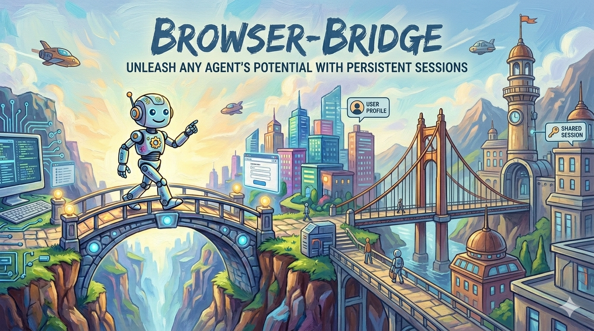

## 「复刻Codex浏览器插件-终篇」 · 墨问

**「复刻Codex浏览器插件-终篇」**

之前的几篇都是介绍工程上如何实现功能，但功能实现完成并不代表结束，它只是一个产品生命周期的开始。

产品就像是从高坡往下滚雪球一样，做的功能是为了让雪球站的更高，增加它下落时的势能，而推广则是扫清雪球下落过程中的障碍，让它滚的更快，让产品能走更远（借用不知道从哪里看的例子~）

这个产品的本身是一个复刻，功能虽然单一，但是解决的问题却是刚需。

**Agent 操作浏览器**

之前用 Agent 来操作过浏览器的朋友们不知道还有没有印象，每次在操作需要登录态的网页时都要登录，而且登陆一次还没用，每次浏览器关了再打开又得重新登录。用宋丹丹的话来说，那是相当地蓝瘦！

这是因为，此前 Agent 想操作浏览器那就必须安装 chrome-mcp 或者 chrome-devtools-cli。本质上这是开了一个调试的 Chrome 实例，并不是你常用的那个浏览器，因此你的登录态都丢了。

当然，调试版的 Chrome 也并不是不能保存你的登录态，只是需要你在每次启动浏览器的时候都需要指定数据目录，就算不是相当地蓝瘦，那也是有点蓝瘦滴。为了防止 Agent 随机发挥给你乱指定目录，你不得不提前配置好启动脚本，然后提前登录一遍账号~~

**产品独特的地方**

我这东西，其实 Codex、Kimi、Qoder 等等，都已经出了，按理说我是没必要搞这事儿。但是，如果你也像我一样，想在 Coding Agent 而不是特定的桌面版 APP 里使用，那也许这也是一个不错的选择。

如果，你也有一定的开发能力，已经有了自己专属的 Agent Runtime，想要为他添加操作浏览器的能力，那这个产品太符合需求了。

不需要注册，可自行定制鉴权。不绑定生态，想怎么用就怎么样~

预览版： [https://github.com/dkisser/browser-bridge](https://github.com/dkisser/browser-bridge)

（这是给有一定动手能力的童鞋们提前开放的，如果搞不定运行环境，请耐心等两天）

