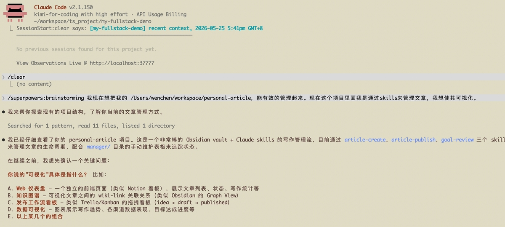
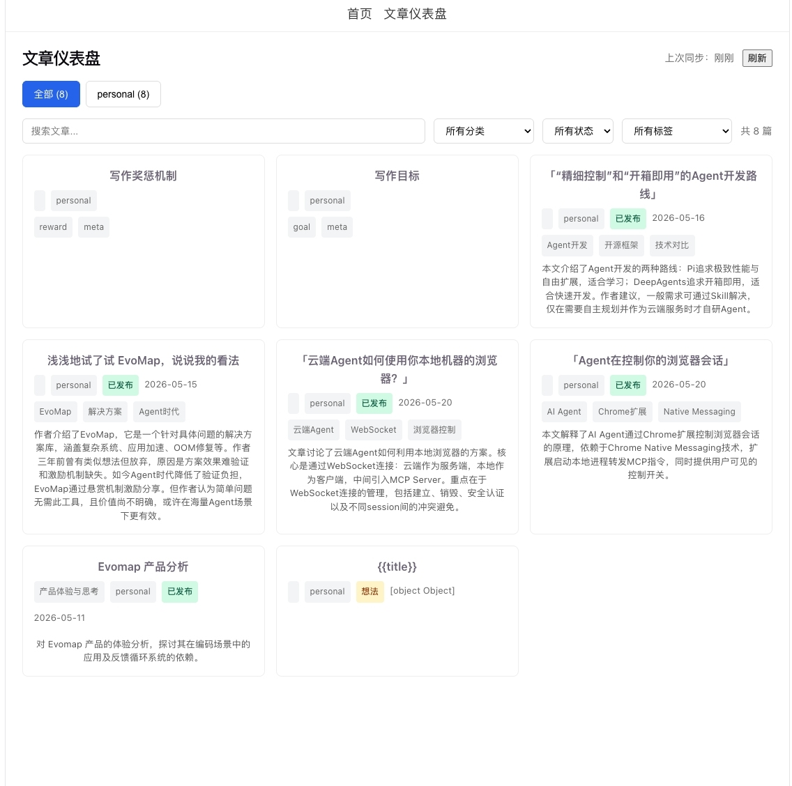
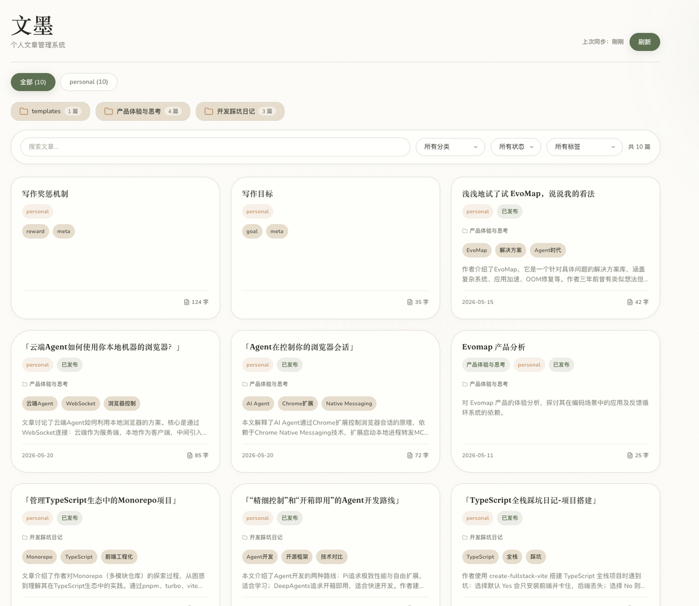
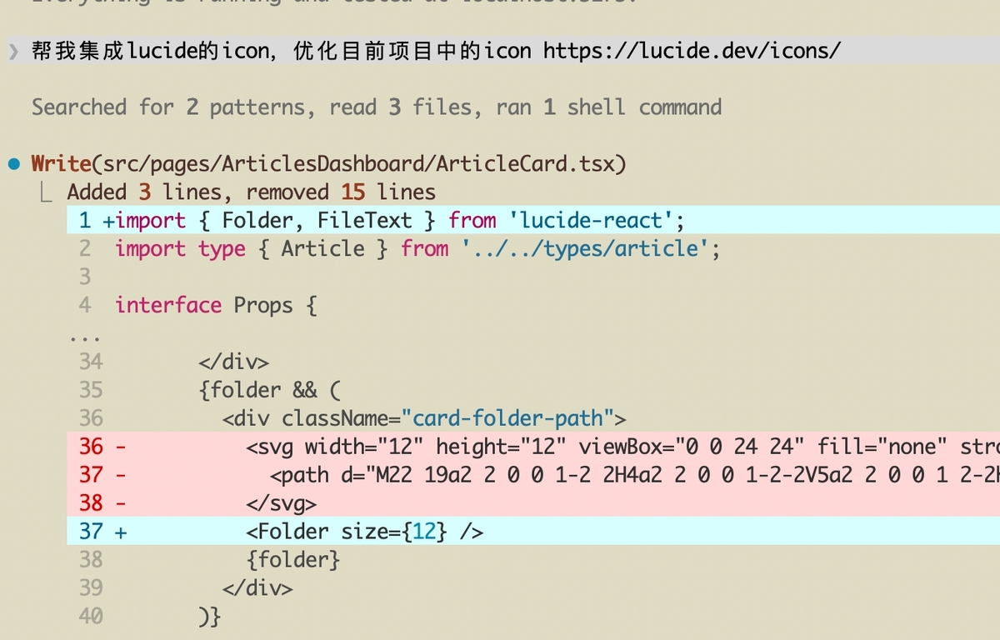
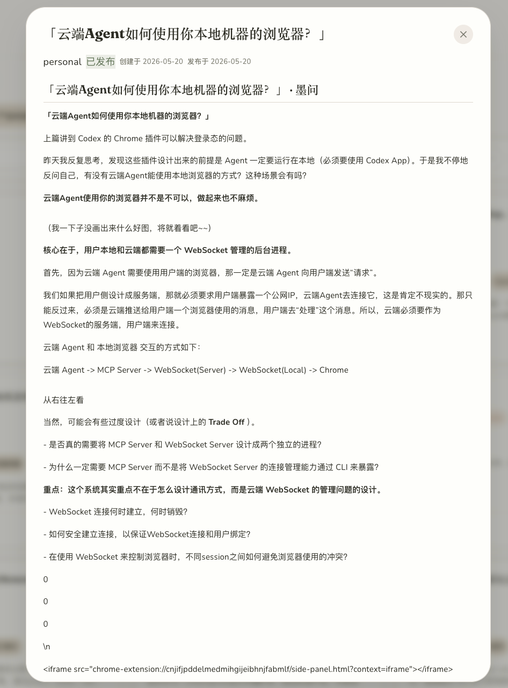
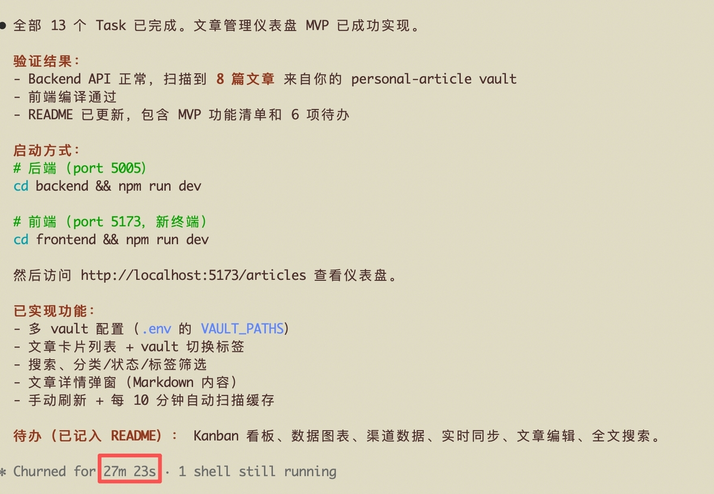

## 「TypeScript全栈踩坑日记-文章管理系统的迭代」 · 墨问

**「TypeScript全栈踩坑日记-文章管理系统的迭代」**

既然是练手，那我肯定找个简单的。

之前 Karpathy 的个人知识库还比较火的时候，我自己弄了个。最开始感觉不错，但是我发现之前剪藏之后，没有把图片下载并替换里面的图片，现在就弄个可视化的地方来管。

（可能是个人习惯。虽然 Obsidian 好用，但是我仍然习惯打开网页~。我嫌打开 Obsidian比较麻烦，但是打开浏览器时就没这个感觉）

**Run fast and Run first**

我习惯先把先后端的功能构建出来，然后再去边看边调。

（用 brainstorming 阐明需求，然后 /bg，接着就可以划水去啦）

**并不是说不需要设计，而是说要保持设计的简单。** 最近我越来越发现，很多事情做着做着到后面要么发现行不通，要么发现之前的假设就是错的。分享下之前我收藏的一句话。

AI 并没有增加了我们成功的机率。而且，它产生了更多的垃圾。但是，它让我们失败的速度变快了，我们能更快的验证自己不成熟的想法。

**修改最不能忍受的点** 。

我发现生成的页面没有任何颜色，纯黑白，极致的复古（ugly）~

这里的优化也比较简单，找一个 design prompts 丢进去就好啦。我选择的是 Organic/Natural 风格。

页面看着有模有样的~，可是查看文章的时候，发现我剪藏的markdown文章的样式没有渲染、图片没有渲染。（我选择让AI自己去修复，去改，就不赘述了）

我感觉这页面好像能用，但是有感觉整体不平衡，这时我考虑是不是需要一些 Icon。

优化过后，顺手能改的地方基本已经改掉了，现在再看看？

看着人模狗样的~~，不过能解决自己的需求就好。

整个项目大概也就一个半小时左右。最开始的构建花了40分钟（阐明需求10多分钟，实现花了27分钟），后面这些小地方的微调，每次也就几分钟（反正肯定在10分钟之内）

今天的失败案例就这样啦~（本身Obsidian其实已经有可视化而且做的双向链接以及可视化都很好，我只是习惯打开网页所以做这个项目。并不是项目本身有经济价值，更多的是情绪价值）

\---附录

Design Prompts: [https://www.designprompts.dev/](https://www.designprompts.dev/)

Lucide: [https://lucide.dev/](https://lucide.dev/)
