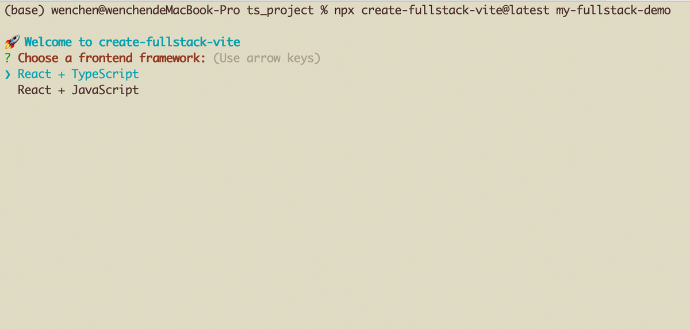
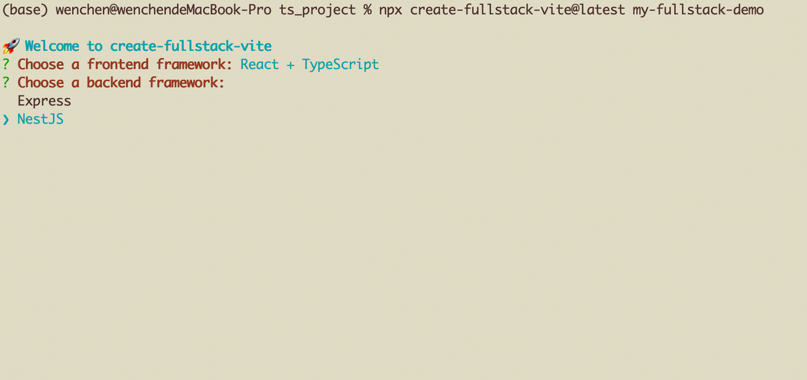
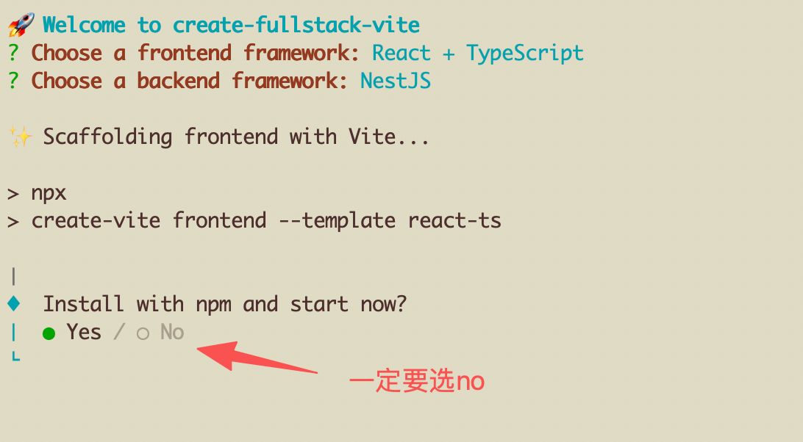
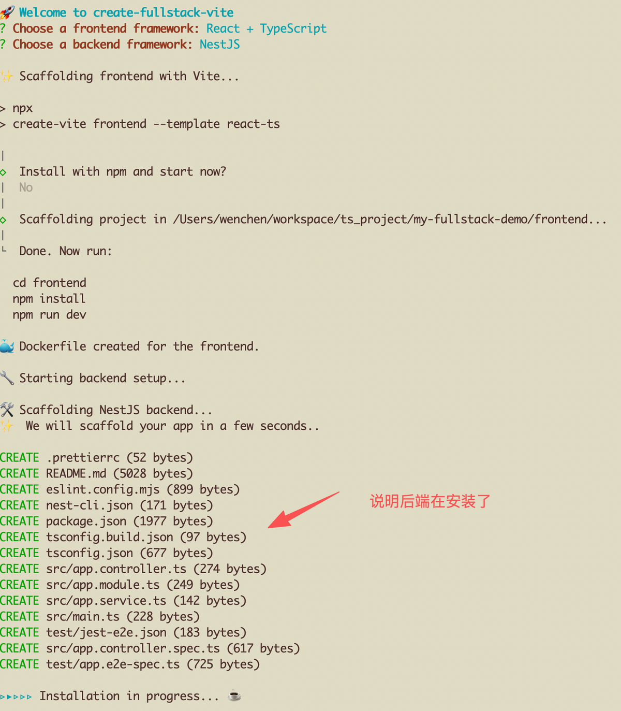
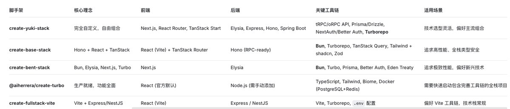

## 「TypeScript全栈踩坑日记-项目搭建」 · 墨问

「TypeScript全栈踩坑日记-项目搭建」

第一次遇到这么坑的构建工具 -- create-fullstack-vite，构建了好几次才给它整明白。

怎么个事儿呢？我来复盘下~~

首先，当你输入下面指令进行构建的时候，会看到下面的内容

```
npx create-fullstack-vite@latest my-fullstack-demo
```

 

选择完前端和后端的框架之后，接着就来到了最坑的地方~~



一旦你选了默认的 Yes，那项目会安装前端应用并启动。可前端一启动，控制台就停在了前端启动之后的地方。

等了一分钟，我感觉不对劲儿，怎么卡着不动了，难道安装完了？接着我用IDE打开项目，发现只安装了前端，后端没了~~

我中断前端的运行，又等了两分钟，发现没有任何事情发生。我感觉有点小不对劲儿，于是删掉项目重装。

这次选择 No，就很流畅了~~



历时10分钟，还是把项目搭起来了，还是有点小开心~~

**关于技术栈。**

前端是React +TypeScript，这个我比较熟悉，而后端 NestJS,我看了下和 Spring 很像，所以用了这个。

其实还有其他全栈的脚手架工具，有兴趣的盆友可以参考下。


