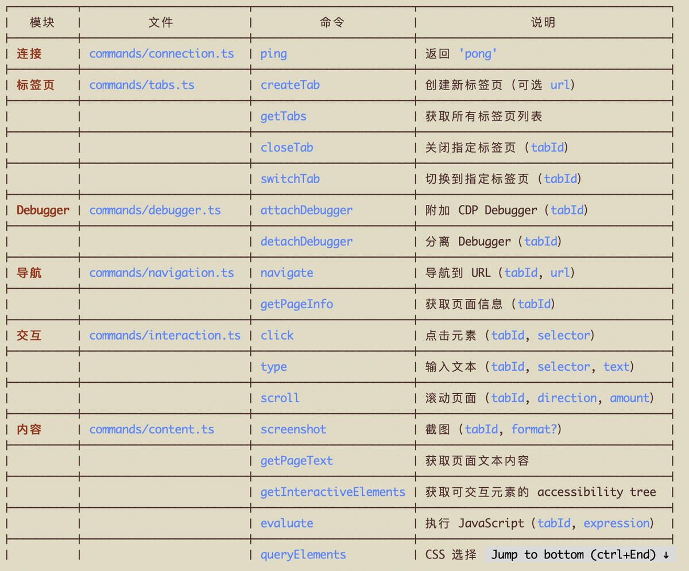
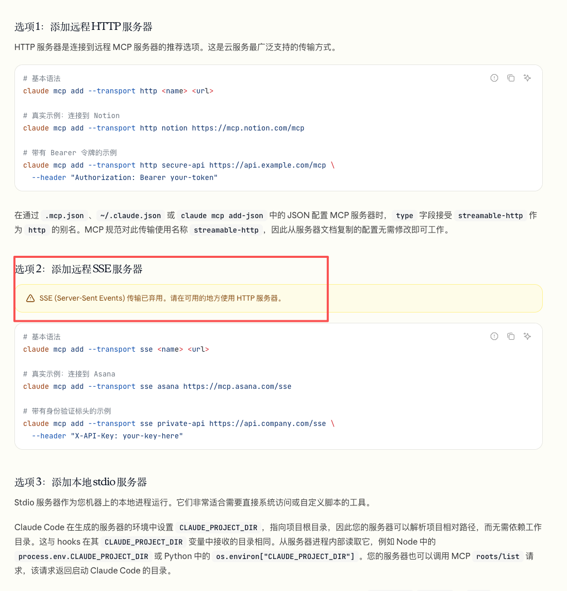

## 「当你要需要MCP Server时，希望你先了解下FastM... · 墨问

**「当你要需要MCP Server时，希望你先了解下FastMCP」**

Codex 前段时间发布了一个能够让 Agent 完全控制浏览器（并继承登录态）的浏览器插件。最近正好手痒，自己实现了一个类似的 Chrome Extension。

主要就分享下使用到的技术栈和踩过的坑。让AI实现的时候，注意下方案立省1天（可能有些夸张🐒）！！

实现所需的技术栈主要就是 Chrome Native Messaging，之前提到过了就不再赘述了。只需要实现下面的功能就好。（我发现有人在pi社区已经做了类似的事儿，可以参考 [https://pi.dev/packages/pi-chrome?name=chrome](https://pi.dev/packages/pi-chrome?name=chrome) ）

今天主要聊的是 Python 生态下和 Agent 之间的集成工具。

目前主流的有两种，一种是使用 CLI，另一种是 MCP。

**CLI 工具**

这个实现起来最简单，基本上使用 Typer这个库就好，如果你还需要美化什么的可以再集成 Rich。

在实现MCP之前需要厘清两个概念，这对你的架构设计很有影响~，过来人的忠告！

**MCP 的传输方式**

MCP Server 有两种传输方式， **Stdio** 和 **Streamable HTTP。**

前者会把 MCP Server的生命周期和 Agent 绑定（MCP Server作为 Agent 的子进程），Agent 销毁了 MCP Server 就销毁了。后者作为一个独立的进程，生命周期完全独立，可同时为多个 Agent 服务。

**MCP工具**

Python生态中原生的mcp也能很好的实现。但是，你让AI自己去实现，那一定是 asyncio + mcp 库等等一大堆原生依赖下的代码，这样的代码有些难看（代码量很多）。因此，建议指定 FastMCP，直接封装了Streamable HTTP的原生支持。

**MCP 避坑指南**

Coding Agent有幻觉，因为大部分的模型知识只到 2025 年 5月左右。让 Agent 自己设计方案的时候，很可能会采用 **SSE的方案，这个是明确已经被弃用了的，要注意** 。

