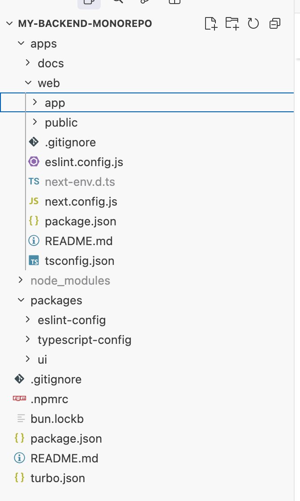

## 「管理TypeScript生态中的Monorepo项目」 · 墨问

我之前有段时间脑子里一直有个疑惑。“为什么前端项目没有和后端（Java）一样，使用多模块来管理项目？”

直到最近看 pi 的代码时，我被它管理模块的方式吸引住了，我一直在想为什么它需要用到多模块？TypeScript多模块怎么用？

（带着疑问我顺道还考古了一段历史，真好玩儿啊~）

**多模块（Monorepo）**

关于多模块，经我考古发现在一个代码仓库里面管理多个模块的代码，这种方式被称为 Monorepo。而且，这个名词似乎由来已久，AI时代这些名词我还是觉得有必要稍微记录下。

（和AI对话的时候这种专属名词的信息密度很高，可以少打很多字来描述）

**TypeScript下的Monorepo**

我发现似乎到2024年才有一个行业事实标准 pnpm、turbo 、vite、jest，分别解决 依赖管理、任务编排、打包、测试。

构建一个demo也很简单，一行指令即可（极简依赖，没有太多内容）。

```
npx create-turbo@latest my-backend-monorepo --example basic
```

这个 `basic` 模板只包含：

`- apps/docs` （一个简单的 Node.js 服务示例）

`- packages/ui` （一个纯 TS 工具包）

`- packages/typescript-config` （TS 配置共享）

你完全可以把 `apps/docs` 重命名为 `api` 或 `service` ，改成你自己的后端应用（比如 Fastify、Express 或纯 Node.js）。



**Monorepo的管理优势**

多模块项目本质目的就是为了控制系统复杂度。通过解耦代码之间的依赖关系，以保持内核稳定。

**反思**

不过，我经手过的前端系统都有一些我 **习以为常的毛病** 。大概特征就是很多人经手（风格都不一样，项目也没有使用代码规范强制约束），代码大量冗余，依赖混乱且没人管。

我不禁思考，这样子的前端系统我能忍受，可换成后端，我就忍不了一点。潜意识里面我是不是把前端看成一种易耗品？（能用就行，要啥自行车儿？）

**吐槽**

前端生态还是有点混乱了，搞一个项目要了解一大堆工具。但是听说最近bun在做的事就是通过一个工具入口来解决工具混乱的问题，类似python的uv、java的gradle/maven。

\---参考链接

[Bun 深度调研：一个想把 JavaScript 工具链全部重写的野心项目](https://juejin.cn/post/7636653992588443683)
