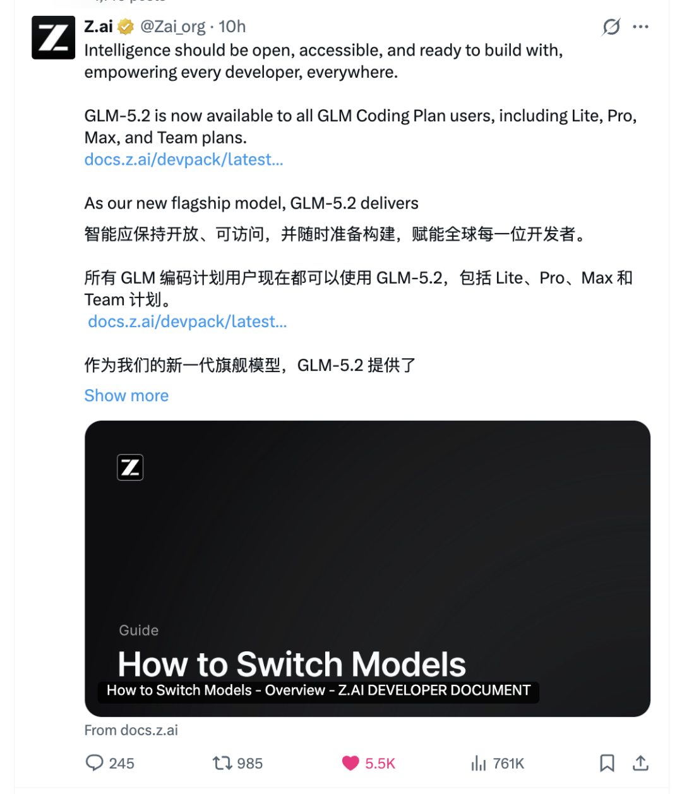
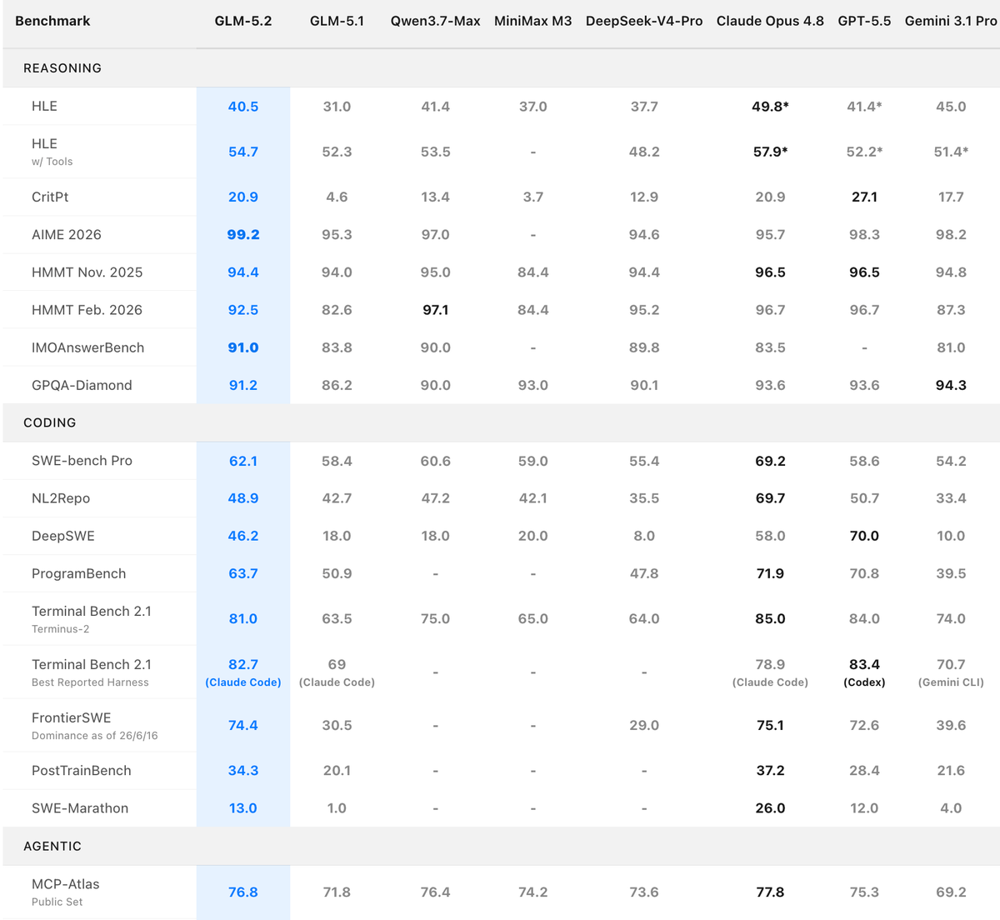
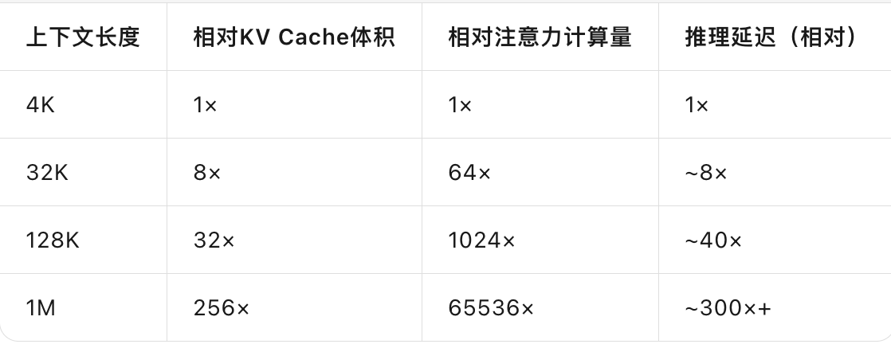

## 「GLM 5.2 技术报告解读」 · 墨问

**「GLM 5.2 技术报告解读」**

上周末国外经历了一场口水战。起因是 Anthropic 收到了美国商务部的一封信，以国家安全为由，要求立刻停掉所有外国人对 Fable 5 和 Mythos 5 的访问。不只是美国境外，连美国境内的外籍人士、Anthropic 自己的外籍员工，都得停。

然后 Anthropic 为了合规，干脆把 Fable 5 和 Mythos 5 对所有人全部关停。好嘛，美国人自己也用不了了。网友们因此吵翻了天。

有趣的是，下午智谱就发了篇公告。

「在一些前沿模型突然变得不可用的时刻，我们选择相信另一条路：前沿智能不应只属于少数人，也不应被少数规则随时收回。」

紧接着，GLM-5.2 来了。真正可用的 1M 上下文，下周开源，走 MIT 协议。

而在昨天，GLM5.2的技术报告出来了，我看完后，斗胆给大家解读下。

**关于跑分的部分**

跑分的话，目前关注更多是 SWE-bench Pro和 Frontier SWE。毕竟长时程、企业级软件工程任务是和大家日常工作息息相关的部分。

可以看到就这两个参数上来看是很接近了。但是这个分数有没有水分，就不好说，毕竟刷分行为太常见了。

**为什么1M上下文难解决？**

不是开放上下文的限制本身很难，难的是在开放之后需要综合成本和计算效率。

**KV Cache 爆炸问题**

每次模型处理一个token时，都需要计算该token与之前所有token之间的注意力权重，而为了加速这一重复计算，推理引擎会将之前所有token的Key和Value向量缓存在GPU显存中。

在短文本场景（如4K token）下，KV Cache的体积相对可控，但在1M token的极端场景下，它迅速膨胀为一只"显存怪兽" 。

以Llama 70B模型为例，在FP16精度下运行1M token上下文，KV Cache的体积约为 **135GB** ，这已经超过了大多数单节点GPU的显存容量 。更麻烦的是，KV Cache的显存占用与序列长度和batch size都呈线性增长关系——当同时处理多个长文本请求时，显存压力会成倍放大。

**给 KV Cache 瘦身**

GLM 的第一层压缩来自 **Multi-Latent Attention（MLA，多潜变量注意力）** 机制（GLM 5开始采用）。MLA最初由DeepSeek在V2中提出，其核心思想是将高维的Key和Value向量投影到一个低维的"潜变量"空间中存储，而非直接缓存完整的K、V张量 。

打个比方，MLA就像是把一本厚重的百科全书压缩成一本精华笔记——你不需要记住每个字，只需要记住关键概念和它们之间的关系。

GLM-5的技术报告中发现，标准MLA（576维潜变量）在配合Muon优化器训练时，性能无法匹敌传统的GQA-8（2048维KV缓存） 。为此，智谱提出了两项关键改进。

**Muon Split** ：将多头查询、键、值的上投影矩阵按注意力头拆分为更小的独立矩阵，分别应用矩阵正交化。GLM-5技术报告Table 1显示，Muon Split后的MLA在Hellaswag（77.8 vs 77.3）、MMLU（62.5 vs 61.2）等指标上追平或超越GQA-8 。

**MLA-256** ：将注意力头维度从192增加到256，头数量减少1/3。技术报告原文："在保持训练计算量和参数数量不变的情况下，降低了解码计算量" 。这个变体在Table 1中被正式命名为MLA-256。

MLA-256的效果是将KV缓存压缩为一个低维潜变量向量，相比标准MHA需要缓存所有注意力头各自的K和V向量，实现了 **数量级的KV Cache体积压缩** 。这是支撑长上下文的 **第一层基础** 。

**FP8量化：KV Cache显存减半**

FP8（E4M3格式）是一种8位浮点格式，相比FP16可以将存储需求 **减半** 。这是支撑长上下文的 **第二层基础** ——在MLA-256已经大幅压缩KV Cache维度的基础上，FP8进一步将每个维度的存储空间砍半。(GLM-5时代已支持）

**DSA 解决 Transformer 计算量爆炸问题**

DSA（DeepSeek Sparse Attention）的核心机制是一个轻量级的 **索引器（Indexer）** ，它对每个新生成的query token，扫描整个前缀中的所有token， **给每个token打相关性分数，然后只选取得分最高的token执行精细的注意力计算** 。技术报告中的明确数据："DSA reduces the attention computation by roughly **1.5-2×** for long sequences" 。

DSA的关键优势在于 **选择粒度是token级** 的——选中的token可以来自前缀的任何位置，不需要连续、不需要成块。

换句话说，它假设上下文中与当前token相关的内容是分散的，需要重头扫描。

（而 Kimi 是假设与当前token相关的内容是成块儿出现的，它是先分成一块块儿的区块，然后计算的相关分数，最后再把相关分数最高的块儿拿来计算。）

DSA 在GLM-5已经被引入，在5.2中是发现已经可以大规模使用了，因此，并不算是什么革命性的发现，只是工程上验证通过了。

GLM-5技术报告:[https://arxiv.org/html/2602.15763v1](https://arxiv.org/html/2602.15763v1)

GLM-5.2技术报告： [https://z.ai/blog/glm-5.2](https://z.ai/blog/glm-5.2)
