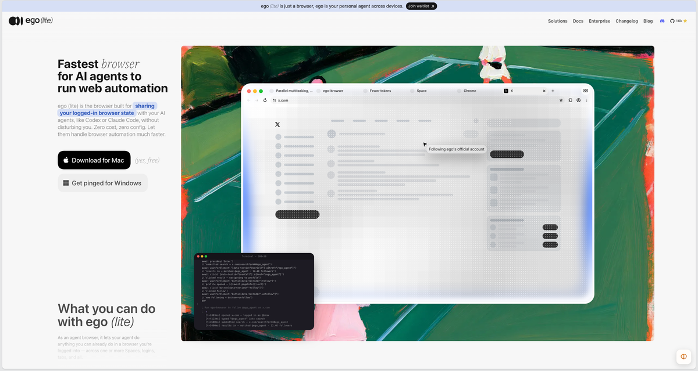
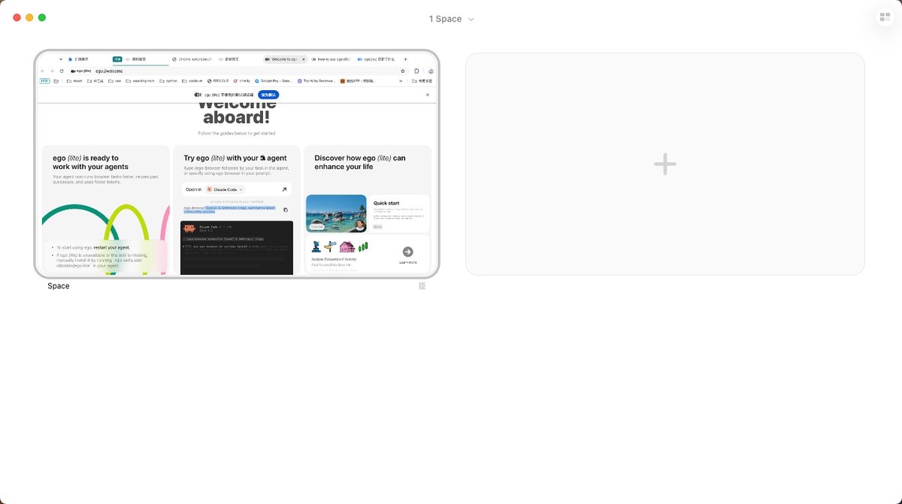
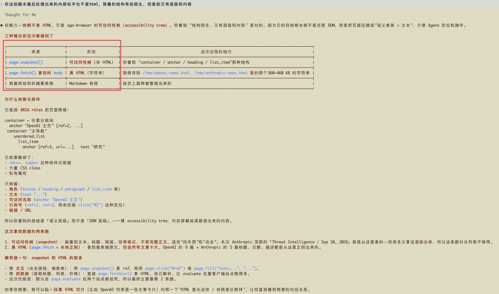

## ego-lite 初体验

之前看过池老师在安利 ego-lite 的笔记，当时没太在意这个事儿。

最近，我在给自己的 browser-bridge 做优化。池老师向我安利了 ego-lite。

好吧，这真得下载了，哈哈哈😁

## logo颜值挺高

看到这个logo，我第一反应是。只有黑白色，加上一些简单的图案。但是越看约觉得不简单。

之前我找Gemini帮我设计了图标，基本上是入不了眼~

**从这里我推测出来简约是这个产品的基调。**

## Space 设计堪称神迹

官方的说法是让Agent操作的区域和人操作的区域分开。

好吧，我想说其实多个tab加分组也能让人和agent的操作区域分开。但是引入space后，在界面变得更加简洁。 **我觉得AI时代，注意力真的很稀缺，这样简洁的设计非常关键。**

## Accessibility Tree加速访问

我本来以为它是获取到html原文，然后提取数据。但是从我自己的实验来看，并不是。

这里的 Accessibility tree 是Chrome内核自带的，能很大程度简化页面结构。

## 我的启发

我发现不仅是pinchTab还是ego-lite，都是有相同的提取模式。 **在做页面信息提取的时候，先提取骨架，然后再逐节点去放大，获取原始内容。**

字数 513 / 20000

<iframe allow="clipboard-write; web-share" src="chrome-extension://cnjifjpddelmedmihgijeibhnjfabmlf/side-panel.html?context=iframe"></iframe>