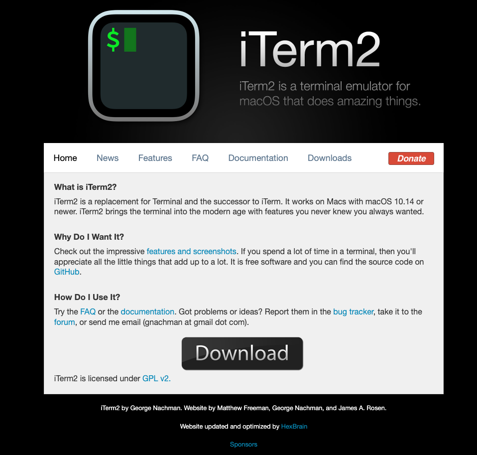
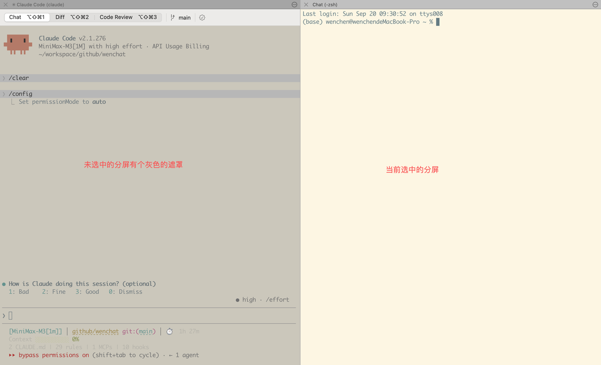
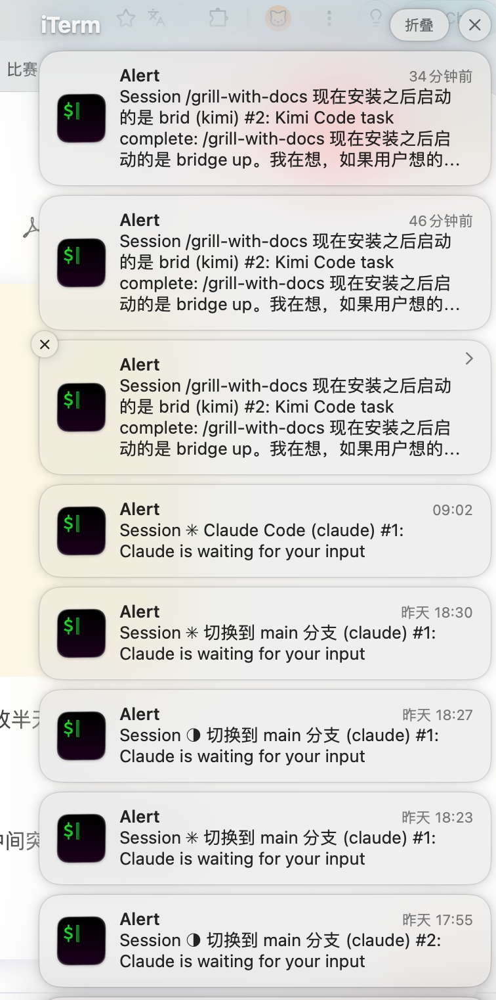

## iTerm 2 真好用

把浏览器换了之后，注意力解放了。所以，又有空钻研新的工具

巧了，就在换 ego-lite 的第二天，我想起 Claude Code 的配置里有 iterm 2 的选项。

今天正好去试试~

不试不知道，原来我之前在原生terminal上折腾半天的功能，这款工具直接就内嵌了！😂

## 分屏

使用 terminal 分屏，你得安装 tmux，还得折腾 tmux-plugin搭配颜色啥的。没个半天你根本搞不出来，就算用 Agent 帮你弄，起码也得俩小时。

在 iTerm2 里面就是很简单。快捷键：cmd + d 直接分屏，cmd + w 删除选中的分屏，和平时操作的习惯差不多。

这里真忍不住要吐槽 tmux的反人类设计了。默认快捷键真是 \[goushi\]，自己去改又改半天不生效。

## 主动通知

在使用 terminal的时候，总是担心 agent 执行完了我不能及时的感知，或者是中间突然有个什么我需要决策的地方卡半天。

**每天盯着屏幕看，目光逐渐陷入呆滞🙃**

现在不用了，通过mac的通知栏就知道有哪些事儿得及时处理，不用来回切终端或者浏览器页面。

iTerm 2 还有很多其他的功能，得等我试过之后才知道。不过，就现在来看已经超出预期了。

我发现只要注意力省下来，人也会变得开心。😄

字数 536 / 20000